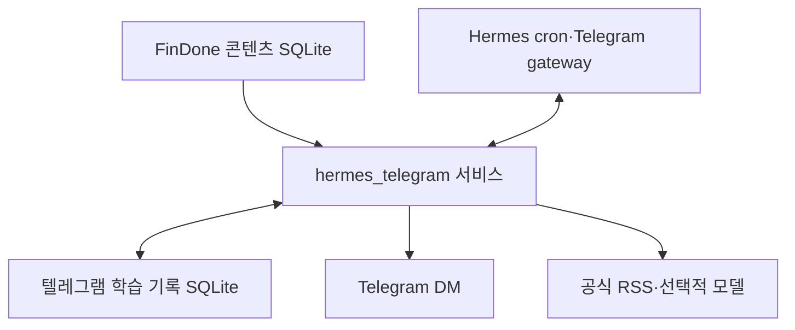

# FinDone × Hermes 텔레그램 금융 학습 서비스 설계서

> 버전 0.1 · 2026-10-03 · 상태: 설계안(미구현)

## 1. 목적과 범위

FinDone에 이미 있는 금융 개념과 객관식 문항을 텔레그램으로 짧게 학습한다. Hermes는 정해진 시각의 발송, 답장 수신, 주간 복습, 영문 금융 뉴스레터를 연결한다. 학습자가 앱을 따로 열지 않아도 하루에 몇 분씩 문제를 풀고, 자주 틀리는 개념을 다시 볼 수 있게 하는 것이 목적이다.

| 포함 | 첫 버전에서 제외 |
| --- | --- |
| 매일 개념+퀴즈, 숫자 답장 채점과 해설 | LearnUs 웹페이지 패널·브라우저 확장 |
| 주간 약점 리포트와 복습 문제, `/stats` | Android 앱의 개인 기록과 자동 동기화 |
| 아침 영문 금융 뉴스 1~2건, 영·한 요약·관련 개념·어휘 | 기업보험 업무 시스템 연결, DCM 발행사 케이스 브리핑 |
| `/why`로 필요한 문제만 추가 설명 | Kotlin에서 생성하는 계산형 문제 |

프로젝트 코드는 **[FinDone 기존 레포](https://github.com/Sooobeo/FinDone)의 루트에 `hermes_telegram/` 폴더를 새로 만들어** 관리한다. Android 앱과 관리자 화면은 그대로 두고, 텔레그램 기능을 독립적인 Python 패키지로 만든다. 이 문서의 레포 내 권장 위치는 `hermes_telegram/SERVICE_DESIGN.md`이다.

## 2. 사용자 경험

초기 예약 시간은 모두 **Asia/Seoul** 기준이며 사용 후 조정할 수 있다.

| 시각 | 동작 | 내용 |
| --- | --- | --- |
| 매일 08:00 | 뉴스레터 | 영문 금융 기사 1~2건, 원문·발행일·영/한 요약·FinDone 개념·영어 어휘 |
| 월~토 12:30, 20:30 | 퀴즈 | 개념 1개와 5지선다 2문항. 문항 수 설정 범위 1~4개 |
| 일 12:30 | 일반 퀴즈 | 평소와 동일 |
| 일 20:30 | 주간 복습 | 저녁 일반 퀴즈를 대신해 약점 요약과 재도전 2~3문항 |

예시 흐름:

```text
FinDone | 오늘의 개념: 채권 가격과 수익률
개념: ...
Q1. ... ① ... ② ... ③ ... ④ ... ⑤ ...
Q2. ... ① ... ② ... ③ ... ④ ... ⑤ ...
답장: 2,4

사용자: 2,4
봇: 1번 정답 · 2번 오답(정답 ③)
    1번 해설: ...
    2번 해설: ...
    더 설명이 필요하면 /why 2
```

숫자는 **이번에 발송한 선택지 순서의 1~5번**이다. 실제 문항은 FinDone DB의 A~E 선택지를 섞어 보낼 수 있으므로, 발송 당시 숫자와 원래 선택지의 대응을 회차에 저장한다.

### 명령과 예외 처리

| 입력 | 처리 |
| --- | --- |
| `2,4` 또는 `1,1,1,1` | 활성 회차의 문항 수와 각 숫자 범위가 맞을 때만 일괄 채점 |
| `/stats` | 최근 7일·30일의 분야별 통계 |
| `/stats FI` | 해당 분야의 요소별 통계까지 조회. `FI`는 예시 분야 ID |
| `/why 2` | 가장 최근 채점 회차의 2번 문항을 더 쉽게 설명. 모델 기능이 꺼져 있으면 기존 해설 제공 |
| `/skip` | 활성 회차를 건너뛰고 다음 예약 발송을 받을 수 있게 함 |
| `/help` | 답장 형식과 명령 안내 |

채팅별 미완료 퀴즈는 최대 1회차다. 다음 퀴즈 시각에 여전히 미완료이면 새 회차를 겹쳐 보내지 않고 기존 회차를 안내한다. 잘못된 형식은 재입력을 요청한다. 중복 답장은 채점 기록을 추가하지 않는다. `/skip`과 미응답은 오답률의 분모에 넣지 않는다. **미완료 회차의 자동 만료는 첫 버전에 넣지 않고**, 실제 사용 후 필요하면 결정한다.

일요일에는 주간 요약을 보내되, 미완료 퀴즈가 있으면 복습 문제는 겹쳐 보내지 않는다. 기존 회차를 마치거나 `/skip`한 뒤 `/review`로 그 주의 복습 문제를 받을 수 있게 한다.

## 3. 데이터와 기능 설계

### 3.1 기존 콘텐츠 활용

원본은 [`app/src/main/assets/content.sqlite3`](https://github.com/Sooobeo/FinDone/tree/main/app/src/main/assets) 및 같은 위치의 `content-manifest.json`이다. 현재 manifest 기준 스키마 v2, 콘텐츠 DB v7, **7개 분야·135개 요소·405개 개념문항·문항당 5개 선택지**가 있다. DB는 읽기 전용으로 열고, 앱의 콘텐츠를 별도로 복제·수정하지 않는다.

- `domains`와 `elements`: 분야/요소 이름, ID와 분류.
- `concept_cards`: 개념 제목, 정의, 직관 설명.
- `concept_questions`: 문제 본문, 기본 해설, 난도, 검수 상태.
- `concept_question_choices`: A~E 선택지, 선택지별 해설, 정답 표시.
- 첫 버전은 `review_status IN ('automated_pass', 'owner_approved')`인 개념문항만 사용해 현재 Android 앱의 노출 규칙과 맞춘다.
- 실행 시작 시 manifest의 DB 버전·크기·해시·문항 수와 실제 파일을 검증한다. 검증 실패 시 잘못된 문제를 보내지 않고 운영 오류를 기록한다.
- 레포 README의 오래된 4지선다 설명보다 **현재 DB와 앱 로더의 5지선다 구조**를 기준으로 구현한다. 초기 발송 문항은 직접 풀어 정확성도 점검한다.

문제는 아직 풀지 않은 항목을 우선하고, 분야가 한쪽으로만 치우치지 않게 순환한다. 같은 문제의 재등장은 주간 복습에서 우선 활용한다. 한 회차의 개념 1개와 문제 2개는 기본적으로 같은 `element_id`에서 고른다. 해당 요소에 적격 문항이 부족하면 다른 요소를 선택한다.

### 3.2 개인 학습 기록

Android 앱의 `user.sqlite3`와 별도의 **텔레그램 전용 로컬 SQLite**를 사용한다. 런타임 DB는 Git 추적 밖의 사용자 데이터 디렉터리에 두고 `STATE_DB_PATH`로 경로를 설정한다. 문제와 선택지는 발송 순간의 스냅샷을 남겨, 나중에 콘텐츠 DB가 갱신되어도 기존 답장을 정확히 채점한다.

| 테이블 | 주요 필드와 제약 |
| --- | --- |
| `quiz_batches` | 회차 ID, Telegram user/chat ID, 종류(`regular`/`review`), 상태(`active`/`graded`/`skipped`), 생성·발송 시각, 콘텐츠 DB 버전. 사용자당 활성 회차 1개 |
| `quiz_items` | 회차 ID, 순번, `domain_id`·`element_id`·`question_id`, 개념/문제/해설 스냅샷, 1~5번 선택지·선택지 해설·정답 번호 스냅샷 |
| `answers` | 회차 ID+문항 순번(유일), 고른 번호, 정오, 제출 시각, `first`/`review` 분류 |
| `news_deliveries` | 정규화한 원문 URL, 발행 시각, 사용자 ID, 발송 시각. 사용자+URL 중복 방지 |
| `job_runs` | 예약 작업 종류+KST 날짜+슬롯의 유일 키, 실행 상태·오류. 재실행 시 중복 발송 완화 |

한 문제를 처음 채점한 기록은 `first`, 같은 `question_id`를 다시 채점한 기록은 `review`로 분류한다. 정오 계산과 DB 저장은 하나의 트랜잭션으로 처리한다. 텔레그램 API에는 완전한 *exactly-once* 발송 보장이 없으므로, 전송 중 프로세스가 종료된 모호한 회차는 자동 재발송하지 않고 기록을 확인하도록 한다.

### 3.3 통계와 주간 복습

기간은 KST 날짜 기준 최근 7일·30일이다. 분야별 오답률은 **채점된 오답 수 ÷ 채점된 문항 수**로 계산한다. 첫 풀이와 재도전은 따로 보여주며 건너뛴 회차와 미응답은 제외한다. 표에는 `오답 수/채점 수`, 백분율, 표본 수를 같이 표시한다.

첫 풀이 5문항 미만인 **분야**는 `표본 부족`으로 표시한다. 한 요소에는 현재 개념문항이 평균 3개라서 같은 5문항 기준을 요소에 기계적으로 적용하지 않는다. `/stats <분야>`의 요소별 값은 실제 분자·분모를 그대로 보여주고, 소표본 비율을 확정적인 약점으로 단정하지 않는다.

일요일 리포트는 반복 오답, 첫 풀이 오답, 최근 재도전 개선을 함께 본다. 예를 들어 `FI: 첫 풀이 6문항 중 오답 4개; FI-02에서 반복 오답`처럼 **실제 집계 수치와 요소 ID**를 근거로 쓴다. 해당 개념의 짧은 복습과 적격 문항 2~3개를 이어서 보낸다. 기록이 부족하면 약점을 지어내지 않고 `판단할 표본이 아직 적음`이라고 알린다. 정량 지표는 코드가 계산하며, 모델은 선택적으로 설명 문장만 다듬는다.

### 3.4 아침 영문 금융 뉴스레터

초기 소스는 [Federal Reserve RSS](https://www.federalreserve.gov/feeds/feeds.htm), [ECB RSS](https://www.ecb.europa.eu/home/html/rss.nl.html), [BIS RSS](https://www.bis.org/rss), [한국은행 영문 RSS](https://www.bok.or.kr/static/view/eng/popup/rss_popup.html)다. 금리·채권·기업재무와 연결되는 최근 영문 원문을 1~2건 고른다. 각 기사에는 다음을 포함한다.

1. 영문 원제목, 실제 발행일, 원문 URL.
2. 영어 요약 1~2문장과 한국어 요약 1~2문장.
3. 관련 FinDone `element_id`, 연결 이유. 억지 연결이면 생략.
4. 원문 문맥에서 유용한 영어 단어 2~3개와 짧은 뜻.

RSS의 발행일과 원문을 확인하고, 날짜·기관명·숫자·링크를 대조한다. 원문 텍스트는 신뢰할 수 없는 입력으로 취급해 그 안의 지시문을 실행하지 않는다. 같은 URL은 재발송하지 않는다. 사실 확인에 실패한 기사는 제외한다. 새 기사가 없으면 `오늘 소개할 신규 기사 없음`을 알리고 오래된 기사를 오늘 기사처럼 포장하지 않는다. 전문을 복제하지 않고 짧게 요약한다.

## 4. Hermes 연동 구조



레포에는 기능 코드와 설치 절차를 둔다. Hermes의 실제 설치 디렉터리에는 **얇은 실행 래퍼와 플러그인**을 배포한다. 특히 script-only cron의 실행 스크립트는 Hermes 규칙상 `~/.hermes/scripts/` 내부에 있어야 하므로, 레포 파일 경로를 cron에 직접 지정하지 않는다.

```text
FinDone/
└─ hermes_telegram/
   ├─ SERVICE_DESIGN.md       # 이 설계서
   ├─ README.md               # 설치·운영·문제 해결
   ├─ pyproject.toml           # Python 의존성 및 테스트
   ├─ src/findone_hermes/
   │  ├─ content.py            # 읽기 전용 DB·manifest 검증
   │  ├─ quiz.py               # 회차 선정·스냅샷·채점
   │  ├─ state.py              # 개인 기록 DB
   │  ├─ stats.py              # /stats·주간 약점 계산
   │  ├─ news.py               # RSS 수집·원문 검증·요약
   │  ├─ messages.py           # 텔레그램 메시지 길이·표시
   │  └─ jobs.py               # 예약 작업 진입점
   ├─ hermes/
   │  ├─ plugin/              # 답장·명령 처리, 설치 대상: ~/.hermes/plugins/
   │  └─ scripts/             # cron 래퍼 원본, 설치 대상: ~/.hermes/scripts/
   └─ tests/
```

| 경로 | Hermes 기능 | 모델 호출 |
| --- | --- | --- |
| 퀴즈·주간 수치 발송 | `--no-agent --script` cron이 Python 작업을 실행하고 표준출력을 텔레그램에 전달 | 0 |
| 숫자 답장·`/stats`·`/skip` | Telegram gateway의 `pre_gateway_dispatch` 플러그인이 직접 처리하고 `skip`으로 일반 에이전트 호출을 막음 | 0 |
| 뉴스 영·한 요약, `/why`, 선택적 주간 설명 | 검증된 원문/집계값만 설정한 모델에 전달 | 설정에 따라 발생 |

플러그인은 `~/.hermes/plugins/<이름>/`에 설치하고 Hermes 설정에서 명시적으로 활성화한다. `pre_gateway_dispatch`는 Hermes 인증보다 **먼저 실행**되므로, 플러그인 내부에서 `platform=telegram`, 개인 DM, 허용된 Telegram 사용자 ID를 다시 검사한다. 예외가 나면 일반 디스패치로 넘어갈 수 있어, 예외 경로에서도 불필요한 모델 호출이나 기록 변경이 생기지 않게 설계·시험한다. Hermes의 기본 `TELEGRAM_ALLOWED_USERS` 허용 목록도 함께 설정한다.

`~/.hermes/config.yaml`의 시간대는 `Asia/Seoul`로 명시한다. 예약 작업을 자동 실행하고 답장을 받으려면 gateway가 실행 중이어야 한다. 사용자의 PC가 꺼져 있으면 예정된 시각에 동작하지 않는다. `cron.catch_up_missed: false`로 오래 놓친 작업의 몰아 보내기를 방지하되, 짧은 유예 시간 내에는 실행될 수 있으므로 작업 자체에도 슬롯별 중복 방지 키를 둔다. 뉴스 작업의 Python 의존성이 Hermes 실행환경과 다르면 사용자 관리 가상환경을 `--interpreter`로 지정한다.

## 5. 비용·보안·운영 조건

| 구성 | 비용과 제약 |
| --- | --- |
| Hermes 소프트웨어·Telegram Bot API | 소프트웨어/봇 API 자체는 무료. PC 구동 및 인터넷 연결 필요 |
| 퀴즈·채점·기본 통계·수치 중심 주간 복습 | 스크립트 처리이므로 모델 API 비용 0 |
| 영·한 뉴스 요약·추가 설명 | 외부 모델 API를 쓰면 사용량에 따라 과금 또는 무료 한도 소진. 로컬 모델이면 API 비용은 없지만 실행 PC 성능과 요약 품질에 제약 |
| 상시 수신/정시 발송 | PC를 계속 켜거나 별도 호스팅 필요. 유료 서버는 선택 사항 |

BotFather에서 받은 토큰과 개인 Telegram ID는 운영 환경에만 둔다. `TELEGRAM_BOT_TOKEN`, `TELEGRAM_ALLOWED_USERS`, 모델 API 키는 Git·설계서·로그에 적지 않는다. 런타임 SQLite도 Git 밖에 둔다. 허용되지 않은 사용자와 그룹 메시지는 처리하지 않으며, 필요하면 학습 기록은 사용자 단위로 삭제할 수 있게 한다. 선택적 모델에는 최소한의 문제 내용 또는 뉴스 원문만 전달하고 Telegram ID와 답안 이력 전체를 넘기지 않는다.

메시지가 텔레그램의 길이 제한을 넘으면 회차 ID와 순번을 유지한 채 나누어 보낸다. RSS 오류, 모델 오류, 기사 없음, PC 재시작 후 답장, 같은 답장 반복, 같은 예약 슬롯 재실행을 운영 시나리오로 다룬다. 오류 때문에 뉴스 요약이 실패해도 퀴즈 채점은 계속 동작하도록 경로를 분리한다.

## 6. 구현 순서와 완료 기준

| 단계 | 작업 | 확인할 결과 |
| --- | --- | --- |
| 1. 콘텐츠 | `hermes_telegram/` 패키지 생성, DB·manifest 검증, 적격 문제 조회 | 임의 요소의 5지선다·정답·해설이 현재 Android 노출과 일치 |
| 2. 텔레그램 MVP | 사용자 1명 허용, 회차 스냅샷, 정시 퀴즈, 숫자 답장·`/skip`·`/help` | `2,4` 답장을 정확히 채점하고 재시작 뒤에도 중복 채점하지 않음 |
| 3. 학습 기록 | `/stats`, 첫 풀이/재도전 분리, 일요일 약점 리포트·복습 | 미응답 제외·소표본 표시·반복 오답 집계가 고정 예시와 일치 |
| 4. 뉴스 | 공식 RSS, 원문 검증, 중복 제거, 영·한 요약·개념 연결 | 링크·발행일·숫자를 원문과 대조하며 기사 없음도 처리 |
| 5. 운영 | 설치 가이드, 비밀값 분리, 재시작·시간대·길이·실패 경로 검증 | 실제 KST 예약 발송 및 본인만 답장 가능함을 확인 |

레포의 현재 `tools/repo_preflight.py`는 `admin`, `model`, `android` 범위만 인식한다. 새 `hermes_telegram/` 파일은 `auto` 검증에서 해당 기능 테스트가 자동 선택되지 않으므로, 구현 시 **Telegram 전용 테스트 범위와 CI 연결**을 추가한다. 레포의 `AGENTS.md`에 있는 변경 전 점검과 완료 전 검증 절차도 따른다.

### 첫 버전 수용 기준

- 본인 ID의 DM만 처리하며 토큰·학습 DB가 커밋되지 않는다.
- 발송 선택지 순서를 섞어도 숫자 답이 원래 정답에 정확히 매핑된다.
- 잘못된 답장·중복 답장·`/skip`·미응답은 통계를 오염시키지 않는다.
- 주간 리포트는 실제 채점 기록만 인용하고 데이터가 부족하면 그렇게 표시한다.
- 뉴스에는 실제 원문 링크·발행일이 있으며 같은 URL을 중복 발송하지 않는다.
- Hermes gateway가 꺼져 있거나 PC가 잠든 상태에서는 정시 전달을 보장하지 않는다는 운영 제약이 README에 적혀 있다.

## 7. 구현 전에 확정할 값

초기값은 **08:00 뉴스, 12:30·20:30 퀴즈, 회차당 2문항, 일요일 저녁 복습**으로 둔다. 실제 연결 단계에서 본인 Telegram ID, BotFather 토큰, 모델 방식(외부 API 또는 로컬 모델), PC 상시 가동 여부를 정해야 한다. 비밀값은 채팅이나 레포에 공유하지 않고 운영 환경에 직접 입력한다. 모델을 설정하지 않아도 퀴즈·채점·통계부터 사용할 수 있다.

## 참고 자료

- [기존 프로젝트 노션 계획](https://app.notion.com/p/2026-agent-conference/hermes-3e7058971140801290bee316e6879ad3)
- [FinDone 레포](https://github.com/Sooobeo/FinDone) · [콘텐츠 자산](https://github.com/Sooobeo/FinDone/tree/main/app/src/main/assets) · [콘텐츠 DB 빌더](https://github.com/Sooobeo/FinDone/blob/main/tools/build_content_db.py) · [Android 콘텐츠 로더](https://github.com/Sooobeo/FinDone/blob/main/app/src/main/java/com/findone/app/data/ContentRepository.kt)
- [Hermes script-only cron](https://hermes-agent.nousresearch.com/docs/guides/cron-script-only) · [Cron·missed-run 정책](https://hermes-agent.nousresearch.com/docs/user-guide/features/cron) · [시간대](https://hermes-agent.nousresearch.com/docs/user-guide/configuration#timezone)
- [Hermes Telegram](https://hermes-agent.nousresearch.com/docs/user-guide/messaging/telegram) · [플러그인](https://hermes-agent.nousresearch.com/docs/user-guide/features/plugins) · [Hooks](https://github.com/NousResearch/hermes-agent/blob/main/website/docs/user-guide/features/hooks.md) · [보안](https://hermes-agent.nousresearch.com/docs/user-guide/security)
- [Hermes 라이선스](https://github.com/NousResearch/hermes-agent/blob/main/LICENSE) · [Telegram API](https://core.telegram.org/api) · [Hermes 로컬 모델 안내](https://hermes-agent.nousresearch.com/docs/guides/local-ollama-setup)
