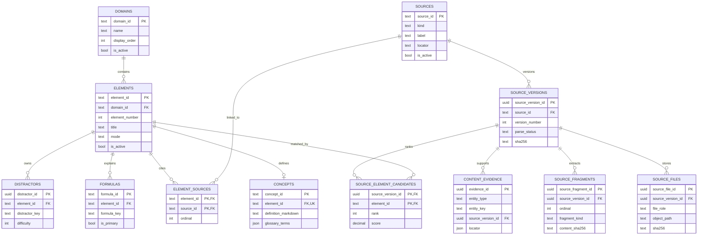
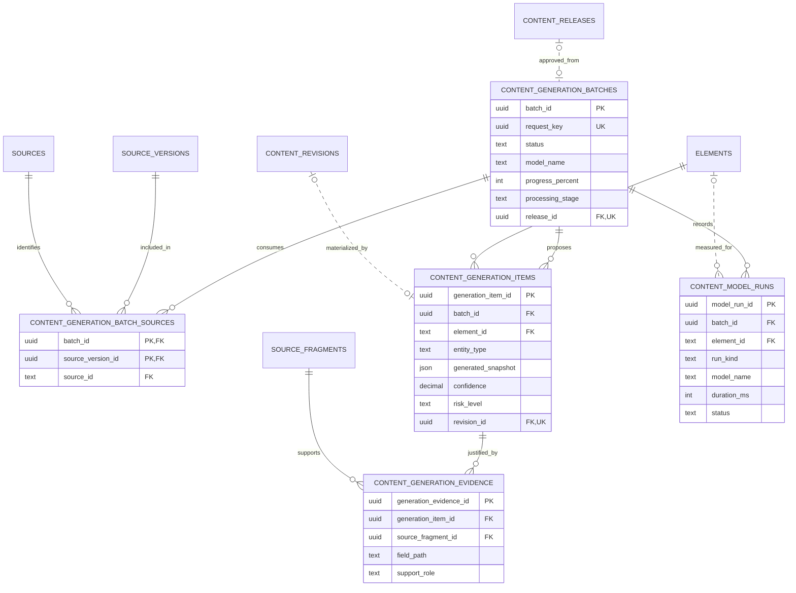
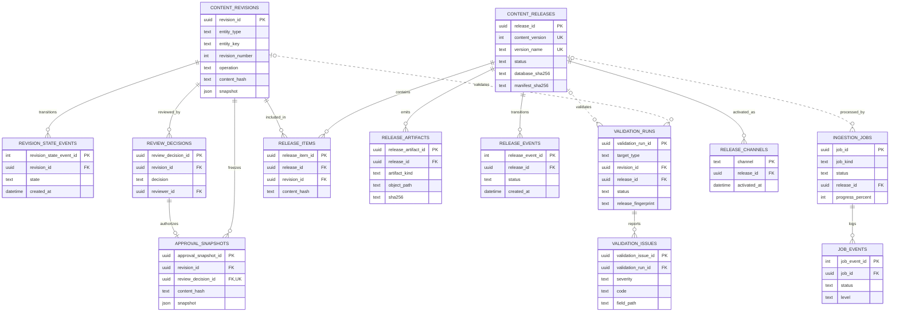
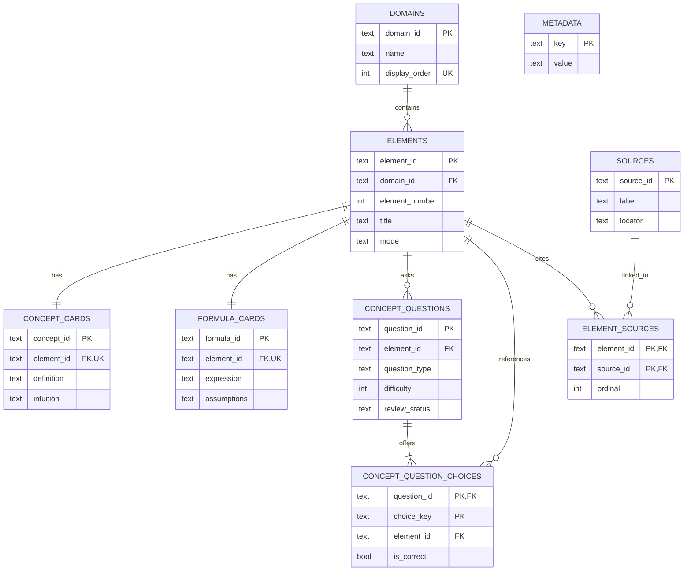
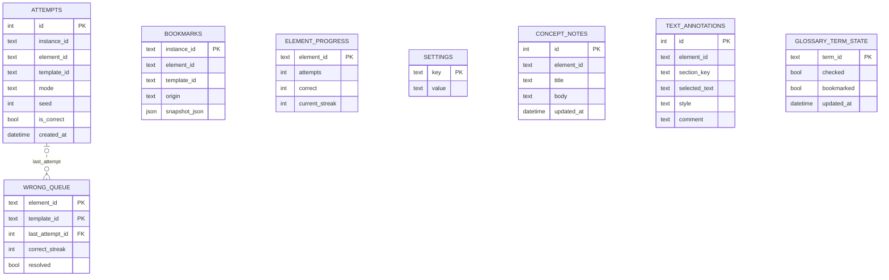

# FinDone 데이터 모델 및 ERD

문서 상태: 2026-08-12 migration과 SQLite DDL 기준

## 데이터 저장소 분리

FinDone에는 역할이 다른 세 데이터 모델이 있다.

| 저장소 | 목적 | 변경 주체 | 배포/보존 |
|---|---|---|---|
| Supabase PostgreSQL | 원본, 저작, 검토, 작업, 릴리스 이력 | Admin과 권한 분리 Worker | migration으로 관리 |
| 앱 콘텐츠 SQLite | 검증된 읽기 전용 학습 콘텐츠 | 로컬 compiler 또는 Release Worker | APK 내장 또는 stable update |
| 사용자 SQLite | 시도, 오답, 북마크, 메모, 주석, 용어 상태 | Android 앱 사용자 | 콘텐츠 교체와 독립, 기기 보존 |

ERD는 읽을 수 있도록 bounded context별로 나눈다. 전체 컬럼과 trigger/RLS의
최종 기준은 [Supabase migrations](../../supabase/migrations)와
[`SCHEMA_SQL`](../../tools/build_content_db.py),
[`UserDatabase`](../../app/src/main/java/com/findone/app/data/UserRepository.kt)다.

## Supabase: 원본과 저작

`content_evidence.entity_type + entity_key`는 concept, formula 등 저작 엔티티를
가리키는 polymorphic key다. 대상 엔티티 존재 여부는 trigger가 검사하며 단일
SQL FK로 표현되지 않는다.

## Supabase: 로컬 생성 파이프라인

`content_model_runs`는 외부 API 응답 로그가 아니라 체크인된 결정론적 로컬 규칙
실행 audit다. 현재 계약에서는 input/output token이 0이다.

## Supabase: revision, 검토와 릴리스

`validation_runs`는 revision, release, system 중 정확히 한 target 형태만 허용한다.
릴리스 검증에는 release item과 artifact를 포함한 fingerprint가 묶이므로 검증 뒤
내용이 바뀐 stale release는 활성화할 수 없다.

## 앱 콘텐츠 SQLite schema 2

`knowledge_fts`는 `elements`의 검색 projection인 FTS5 virtual table이다. FK를
갖지 않으며 compiler가 같은 transaction에서 채우고 검증한다.

### Authoring에서 앱 DB로의 투영

| Supabase/생성 원천 | 앱 SQLite | 규칙 |
|---|---|---|
| `domains` | `domains` | 활성·승인된 분야만 |
| `elements` | `elements` | 안정적인 `element_id` 유지 |
| `concepts` | `concept_cards` | element당 1개 |
| primary `formulas` | `formula_cards` | element당 앱용 primary 1개 |
| `sources`, `element_sources` | 같은 이름의 두 테이블 | 출처 추적 보존 |
| 생성·검토된 question bank | `concept_questions`, `concept_question_choices` | 정확히 5개 선택지와 1개 정답 |
| release/build metadata | `metadata`, manifest | schema, version, hash, release status |

Admin의 `distractors`는 저작 후보 단위이고 앱의 5지선다 choice row와 동일한
스키마가 아니다. question/choice ID가 없는 legacy distractor를 임의로 앱
질문은행에 덮어쓰지 않는다.

## 사용자 SQLite schema 5

`element_id`, `term_id`와 template 식별자는 콘텐츠 DB를 논리적으로 참조하지만
서로 다른 SQLite 파일 사이에 물리 FK를 만들 수 없다. 앱은 콘텐츠 업데이트
뒤에도 안정 ID를 유지하고, 사라진 콘텐츠를 조회할 때 안전하게 무시하거나
정리한다. 사용자 DB의 유일한 물리 FK는 현재 `wrong_queue.last_attempt_id`에서
`attempts.id`로 이어지며 삭제 시 `NULL`이 된다.

## 주요 불변조건

- authoring row는 audit column과 revision snapshot으로 추적한다.
- 승인 snapshot과 release item의 `content_hash`는 동일해야 한다.
- release artifact의 저장 hash, release row hash와 실제 파일 hash가 같아야 한다.
- 앱 DB의 manifest row count, byte size, SHA-256과 SQLite 실물이 같아야 한다.
- 콘텐츠 DB schema와 사용자 DB schema version은 독립적으로 증가한다.
- RLS와 RPC 권한은 migration의 일부이며 ERD만 보고 권한을 추론하면 안 된다.
