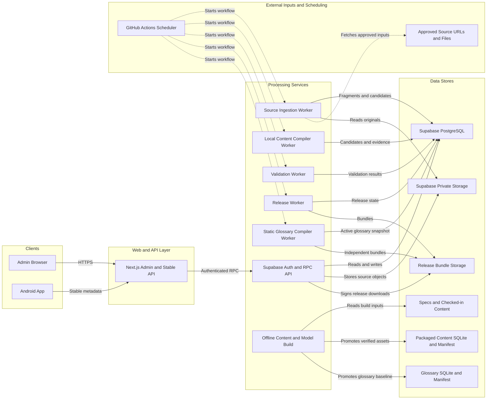
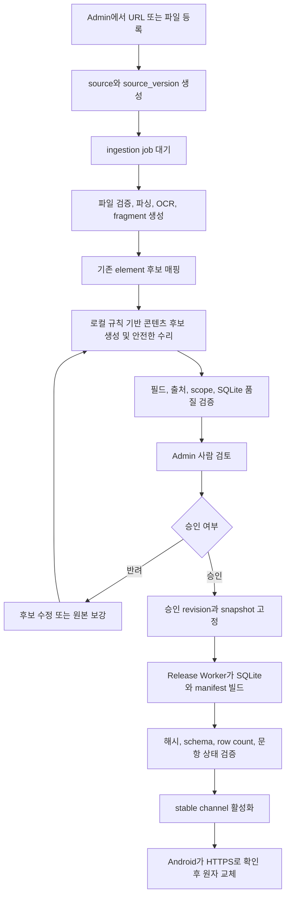

# FinDone 시스템 아키텍처

문서 상태: 2026-08-12 코드와 migration 기준

## 목적과 핵심 원칙

FinDone은 Android 오프라인 학습 앱, Next.js Admin, Supabase 저작·검토 DB,
Python Worker와 결정론적 콘텐츠 빌드 도구로 구성된다. 핵심 경계는 다음과 같다.

- 학습 콘텐츠, 독립 용어집, 사용자 데이터는 서로 다른 SQLite 파일이다. 어느
  읽기 전용 DB를 교체해도 학습 기록·용어 메모·본문 주석을 덮어쓰지 않는다.
- 원본 파일 업로드, 텍스트 추출, 앱 콘텐츠 후보 생성, 사람 검토, 릴리스는
  서로 다른 상태와 권한 경계를 가진다.
- 용어 의미의 최초 초안은 개발/Admin 저작 Agent로 만들 수 있지만, 검증본만
  Admin에 적재한다. Admin 편집·컴파일·배포와 Android 런타임에는 LLM 경로가 없다.
- Admin은 온라인 LLM을 호출해 모델을 학습시키는 장소가 아니다. 저장소에
  체크인된 로컬 변환기와 오프라인 모델 실험 결과를 조회하고 최종 검토한다.
- 학습 콘텐츠 모델링은 외부 LLM API 없이 재현 가능한 Python·scikit-learn
  파이프라인을 사용한다.
- `bootstrap_not_reviewed`와 `candidate`는 개발 상태이며 `release_ready`만
  릴리스할 수 있다.

## 구성요소

`Supabase PostgreSQL`의 `ingestion_jobs`, generation batch와
`glossary_compile_jobs`가 작업
큐 역할을 한다. 별도 메시지 브로커는 구현되어 있지 않다. Worker는 RPC로
작업을 원자적으로 claim하고 lease, retry, 진행률과 오류를 DB에 기록한다.

## 원본 업로드부터 앱 반영까지

상태 배지는 단계 이름이 아니라 DB의 실제 작업 상태를 표시해야 한다.
`processing` 또는 `가공중`은 Worker가 claim했거나 실행 가능한 작업이 존재할
때만 사용한다. Worker 비활성화, lease 만료 또는 실패는 각각 대기·재시도·실패
상태로 구분한다.

## 로컬 모델과 콘텐츠 빌드의 관계

| 영역 | 구현 | 산출물 | 앱 런타임 사용 |
|---|---|---|---|
| 원본 콘텐츠 변환 | `tools/admin_content_generation_worker.py`, `tools/local_content_model.py` | 검토 후보, evidence, model run audit | 승인 후에만 간접 반영 |
| 개념문항 후보 순위화 | `tools/train_concept_question_model.py` | 질문은행 후보, ranker artifact, 실험 보고서 | Python 모델을 앱에 탑재하지 않고 생성 결과만 사용 |
| 앱 DB 컴파일 | `tools/compile_app_content.py`, `tools/build_content_db.py` | `content.sqlite3`, `content-manifest.json` | 직접 사용 |
| 용어집 저작·컴파일 | `tools/generate_glossary_content.py`, `tools/admin_glossary_worker.py` | 검토된 용어 JSON, `glossary.sqlite3`, manifest | 생성 Agent는 저작 시에만, 앱은 정적 결과만 사용 |
| 앱 퀴즈 실행 | Kotlin `QuizEngine`과 패키지 질문은행 | seed 기반 문제 인스턴스 | 기기에서 오프라인 실행 |

Admin의 모델 대시보드는 실험·데이터량·품질 게이트를 보여주는 관측 화면이다.
현재 bootstrap test 수치는 사람 독립 test가 아니므로 실제 교육 품질이나
일반화 성능으로 해석하지 않는다.

## 런타임 및 신뢰 경계

| 경계 | 허용 권한 | 금지 또는 제한 |
|---|---|---|
| Admin browser | 로그인 사용자의 RLS 범위 조회, 역할별 검토 | service role secret 노출 금지 |
| Next.js server routes | Supabase server client, stable metadata 제공 | 공개 환경에서 demo fixture 노출 금지 |
| Source Worker | private source object 읽기, fragment·candidate 쓰기 | 임의 사설망 URL 접근, 무제한 파일 처리 금지 |
| Generation Worker | service role로 batch claim·완료 | Admin 사용자가 직접 queue 생성 불가 |
| Validation Worker | revision 또는 release 검증 결과 기록 | authoring content 직접 수정 금지 |
| Release Worker | 승인 snapshot으로 bundle 생성·활성화 | 미승인 revision, stale validation으로 공개 금지 |
| Glossary Worker | active Admin snapshot을 결정론적으로 FTS5 DB로 컴파일 | 모델 호출, Admin 원문·source ID의 앱 DB 포함 금지 |
| Android app | 공개 HTTPS stable endpoint 읽기 | Admin DB, source 원문, service secret 접근 금지 |
| User SQLite | 기기 내 학습 기록 저장 | 콘텐츠 SQLite와 합치거나 서버에 자동 업로드 금지 |

## 품질 게이트

1. 생성 도구는 같은 입력에서 같은 JSON·SQLite를 만들어야 한다.
2. Admin fixture는 임시 canonical export와 byte 단위로 같아야 한다.
3. 모델 CI는 GitHub와 같은 상대경로 명령을 실행한다.
4. SQLite integrity, FK, schema, 필수 필드, source traceability와 row count를
   검사한다.
5. release artifact와 validation fingerprint가 현재 release 내용과 일치해야
   stable channel을 바꿀 수 있다.
6. 개념문항 은행은 독립 사람 검토가 완료된 `release_ready`여야 한다.
7. Android 다운로드는 HTTPS, 크기 상한, manifest/database SHA-256과 SQLite
   검증을 통과한 뒤에만 기존 콘텐츠를 교체한다.
8. 용어집은 학습 콘텐츠와 독립된 version/channel을 사용하고, Admin에서 archive된
   용어와 비공개 원문 레퍼런스는 다음 앱 snapshot에서 제외한다.

일상 개발 검증은 `testDebugUnitTest lintDebug assembleDebug`만 사용한다. Gradle의
범용 `test`는 release variant까지 선택할 수 있으므로 미검토 문항은행 상태에서
개발 검증용으로 사용하지 않는다.

로컬과 CI의 공통 실행 계약은 [Codex preflight](../operations/CODEX_PREFLIGHT.md)에
정리되어 있다.

## 변경 시 함께 갱신할 문서

- Supabase table, FK, enum 변경: [데이터 모델 ERD](DATA_MODEL_ERD.md)
- Worker 단계·권한 변경: 이 문서와 해당 `tools/README-admin-*-worker.md`
- 릴리스 계약 변경: [릴리스 자동화](../operations/RELEASE_AUTOMATION.md)와
  [릴리스 체크리스트](../operations/RELEASE_CHECKLIST.md)
- 모델 feature, split, metric 변경:
  [모델링 설계](../modeling/CONCEPT_MCQ_MODELING_DESIGN.md)와 실험 보고서
