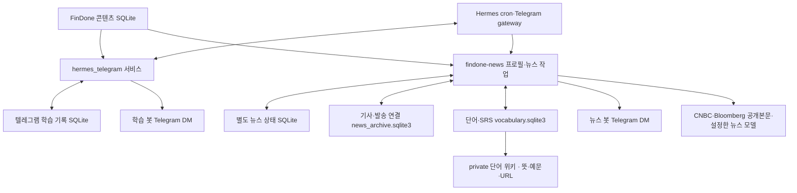

# FinDone × Hermes 텔레그램 금융 학습 서비스 설계서

> 버전 0.3 · 2026-10-03 · 상태: 증권사·보험사 뉴스와 전문용어·구문 학습 구현, 요약 모델 선정 검증 중

구현과 설치 절차는 [README](README.md)를 따른다. 퀴즈·채점·통계와 저장 단어 복습은 모델 없이 동작한다. 뉴스의 한국어 번역·새 단어의 문맥별 뜻·`/why` 추가 설명에는 명시적으로 설정한 모델을 사용하며, 원문·요약 검증 실패 시 해당 기사를 제외한다. 학습 예약의 `emitted`는 Hermes 출력 인계 상태이며 Telegram 수신 확인을 뜻하지 않는다. 뉴스 예약은 뉴스 봇으로 직접 전송해 반환받은 메시지 ID를 기사 스냅샷에 연결한다. 4문항 설정에서는 현재 요소당 최대 3문항이므로 같은 분야의 다른 요소로 보충할 수 있다.

학습과 뉴스는 **별도 Telegram 봇**으로 제공한다. 기본 Hermes 프로필은 `FINDONE_TELEGRAM_MODE=learning`으로 금융 퀴즈·복습을, `findone-news` 프로필은 `FINDONE_TELEGRAM_MODE=news`로 08:00 예약 뉴스·`/now` 즉시 요청·`/word` 저장·`/vocab` 단어 복습을 처리한다. 각 프로필은 독립적인 봇 토큰·`.env`·예약 작업·상태 SQLite를 사용하며, 허용된 본인 ID만 같게 설정한다. 뉴스 모델이 미설정이면 뉴스 준비 불가 안내를 보내고 기사 요약을 생성하지 않는다.

## 1. 목적과 범위

FinDone에 이미 있는 금융 개념과 객관식 문항을 텔레그램으로 짧게 학습한다. Hermes는 정해진 시각의 발송, 답장 수신, 주간 복습, 영문 금융 뉴스레터를 연결한다. 학습자가 앱을 따로 열지 않아도 하루에 몇 분씩 문제를 풀고, 자주 틀리는 개념을 다시 볼 수 있게 하는 것이 목적이다.

| 포함 | 첫 버전에서 제외 |
| --- | --- |
| 매일 개념+퀴즈, 숫자 답장 채점과 해설 | LearnUs 웹페이지 패널·브라우저 확장 |
| 주간 약점 리포트와 복습 문제, `/stats` | Android 앱의 개인 기록과 자동 동기화 |
| CNBC·Bloomberg 증권사·보험사 기사 1~2건, 사건·배경·영향의 영·한 요약 | 구독·로그인 제한 본문의 확보, 기사에 없는 영향·전망 생성 |
| 금융 전문용어·비즈니스 구문 저장·4지선다 복습·SRS, private 위키 | 기업보험 업무 시스템 연결, DCM 발행사 케이스 브리핑 |
| `/why`로 필요한 문제만 추가 설명 | Kotlin에서 생성하는 계산형 문제 |

프로젝트 코드는 **[FinDone 기존 레포](https://github.com/Sooobeo/FinDone)의 루트에 `hermes_telegram/` 폴더를 새로 만들어** 관리한다. Android 앱과 관리자 화면은 그대로 두고, 텔레그램 기능을 독립적인 Python 패키지로 만든다. 이 문서의 레포 내 권장 위치는 `hermes_telegram/SERVICE_DESIGN.md`이다.

## 2. 사용자 경험

초기 예약 시간은 모두 **Asia/Seoul** 기준이며 사용 후 조정할 수 있다.

| 시각 | 봇·동작 | 내용 |
| --- | --- | --- |
| 매일 08:00 | 뉴스 봇·뉴스레터 | 증권사·보험사 기사 1~2건, 원문·발행일·사건/배경/영향의 영·한 요약·전문용어·비즈니스 구문 |
| 월~토 12:30, 20:30 | 학습 봇·퀴즈 | 개념 1개와 5지선다 2문항. 문항 수 설정 범위 1~4개 |
| 일 12:30 | 학습 봇·일반 퀴즈 | 평소와 동일 |
| 일 20:30 | 학습 봇·주간 복습 | 저녁 일반 퀴즈를 대신해 약점 요약과 재도전 2~3문항 |

예시 흐름:

```text
FinDone | 오늘의 개념: 채권 가격과 수익률
개념: ...
Q1. ... ① ... ② ... ③ ... ④ ... ⑤ ...
Q2. ... ① ... ② ... ③ ... ④ ... ⑤ ...
답장: 2,4

사용자: 2,4
봇: 1번 정답 · 2번 오답(정답 ③)
    1번 해설: ...
    2번 해설: ...
    더 설명이 필요하면 /why 2
```

숫자는 **이번에 발송한 선택지 순서의 1~5번**이다. 실제 문항은 FinDone DB의 A~E 선택지를 섞어 보낼 수 있으므로, 발송 당시 숫자와 원래 선택지의 대응을 회차에 저장한다.

### 명령과 예외 처리

다음 명령과 **1~5번** 답안은 학습 봇에서 처리한다.

| 입력 | 처리 |
| --- | --- |
| `2,4` 또는 `1,1,1,1` | 활성 회차의 문항 수와 각 숫자 범위가 맞을 때만 일괄 채점 |
| `/stats` | 최근 7일·30일의 분야별 통계 |
| `/stats FI` | 해당 분야의 요소별 통계까지 조회. `FI`는 예시 분야 ID |
| `/why 2` | 가장 최근 채점 회차의 2번 문항을 더 쉽게 설명. 모델 기능이 꺼져 있으면 기존 해설 제공 |
| `/skip` | 활성 회차를 건너뛰고 다음 예약 발송을 받을 수 있게 함 |
| `/help` | 답장 형식과 명령 안내 |

채팅별 미완료 퀴즈는 최대 1회차다. 다음 퀴즈 시각에 여전히 미완료이면 새 회차를 겹쳐 보내지 않고 기존 회차를 안내한다. 잘못된 형식은 재입력을 요청한다. 중복 답장은 채점 기록을 추가하지 않는다. `/skip`과 미응답은 오답률의 분모에 넣지 않는다. **미완료 회차의 자동 만료는 첫 버전에 넣지 않고**, 실제 사용 후 필요하면 결정한다.

일요일에는 주간 요약을 보내되, 미완료 퀴즈가 있으면 복습 문제는 겹쳐 보내지 않는다. 기존 회차를 마치거나 `/skip`한 뒤 `/review`로 그 주의 복습 문제를 받을 수 있게 한다.

뉴스 봇의 명령과 **1~4번** 단어 답안은 별도 경로로 처리한다.

| 입력 | 처리 |
| --- | --- |
| `/now` | 현재 시각에 최근 미발송 뉴스를 준비하며 08:00 일정은 유지 |
| 기사 메시지에 답장으로 `/word yield` | 정확한 발송 메시지와 기사 스냅샷을 연결해 단어·문맥별 뜻·원문 문장·URL 저장 |
| 기사 메시지에 답장으로 `/word back on track` | 원문에 등장한 여러 단어의 구문도 같은 방식으로 저장; 따옴표 불필요 |
| `/vocab 5` | 복습 시각이 된 저장 단어부터 최대 5개를 4지선다로 준비하고 첫 미답 문항 표시 |
| `1`~`4` | 현재 단어 문항 채점 후 한국어 해설·저장 예문·다음 문항 표시 |
| `/words` | 저장 단어 수와 지금 복습할 수 확인 |

`/word`는 뉴스 봇이 실제 발송한 기사 메시지와 원문의 단어·구문 발생 위치를 확인한다. 제시된 항목의 문맥별 뜻과 그 표현이 나온 정확한 원문 전체 문장을 함께 저장하며, 같은 표현이 나오는 다른 문장으로 바꾸지 않는다. 최근 기사를 추측하거나 다른 사용자의 인용문을 기사로 간주하지 않는다. 같은 입력 메시지는 다시 저장하거나 채점하지 않고, 미완료 단어 회차는 재시작 후에도 이어간다. 뉴스의 단어·구문 학습은 학습 봇의 금융 퀴즈·통계 SQLite를 열거나 변경하지 않는다.

## 3. 데이터와 기능 설계

### 3.1 기존 콘텐츠 활용

원본은 [`app/src/main/assets/content.sqlite3`](https://github.com/Sooobeo/FinDone/tree/main/app/src/main/assets) 및 같은 위치의 `content-manifest.json`이다. 현재 manifest 기준 스키마 v2, 콘텐츠 DB v7, **7개 분야·135개 요소·405개 개념문항·문항당 5개 선택지**가 있다. DB는 읽기 전용으로 열고, 앱의 콘텐츠를 별도로 복제·수정하지 않는다.

- `domains`와 `elements`: 분야/요소 이름, ID와 분류.
- `concept_cards`: 개념 제목, 정의, 직관 설명.
- `concept_questions`: 문제 본문, 기본 해설, 난도, 검수 상태.
- `concept_question_choices`: A~E 선택지, 선택지별 해설, 정답 표시.
- 첫 버전은 `review_status IN ('automated_pass', 'owner_approved')`인 개념문항만 사용해 현재 Android 앱의 노출 규칙과 맞춘다.
- 실행 시작 시 manifest의 DB 버전·크기·해시·문항 수와 실제 파일을 검증한다. 검증 실패 시 잘못된 문제를 보내지 않고 운영 오류를 기록한다.
- 레포 README의 오래된 4지선다 설명보다 **현재 DB와 앱 로더의 5지선다 구조**를 기준으로 구현한다. 초기 발송 문항은 직접 풀어 정확성도 점검한다.

문제는 아직 풀지 않은 항목을 우선하고, 분야가 한쪽으로만 치우치지 않게 순환한다. 같은 문제의 재등장은 주간 복습에서 우선 활용한다. 한 회차의 개념 1개와 문제 2개는 기본적으로 같은 `element_id`에서 고른다. 해당 요소에 적격 문항이 부족하면 다른 요소를 선택한다.

### 3.2 개인 학습 기록

Android 앱의 `user.sqlite3`와 별도의 **텔레그램 전용 로컬 SQLite**를 사용한다. 런타임 DB는 Git 추적 밖의 사용자 데이터 디렉터리에 두고 `STATE_DB_PATH`로 경로를 설정한다. 문제와 선택지는 발송 순간의 스냅샷을 남겨, 나중에 콘텐츠 DB가 갱신되어도 기존 답장을 정확히 채점한다.

| 테이블 | 주요 필드와 제약 |
| --- | --- |
| `quiz_batches` | 회차 ID, Telegram user/chat ID, 종류(`regular`/`review`), 상태(`active`/`graded`/`skipped`), 생성·발송 시각, 콘텐츠 DB 버전. 사용자당 활성 회차 1개 |
| `quiz_items` | 회차 ID, 순번, `domain_id`·`element_id`·`question_id`, 개념/문제/해설 스냅샷, 1~5번 선택지·선택지 해설·정답 번호 스냅샷 |
| `answers` | 회차 ID+문항 순번(유일), 고른 번호, 정오, 제출 시각, `first`/`review` 분류 |
| `news_deliveries` | 정규화한 원문 URL, 발행 시각, 사용자 ID, 발송 시각. 사용자+URL 중복 방지 |
| `job_runs` | 예약 작업 종류+KST 날짜+슬롯의 유일 키, 실행 상태·오류. 재실행 시 중복 발송 완화 |

한 문제를 처음 채점한 기록은 `first`, 같은 `question_id`를 다시 채점한 기록은 `review`로 분류한다. 정오 계산과 DB 저장은 하나의 트랜잭션으로 처리한다. 텔레그램 API에는 완전한 *exactly-once* 발송 보장이 없으므로, 전송 중 프로세스가 종료된 모호한 회차는 자동 재발송하지 않고 기록을 확인하도록 한다.

### 3.3 통계와 주간 복습

기간은 KST 날짜 기준 최근 7일·30일이다. 분야별 오답률은 **채점된 오답 수 ÷ 채점된 문항 수**로 계산한다. 첫 풀이와 재도전은 따로 보여주며 건너뛴 회차와 미응답은 제외한다. 표에는 `오답 수/채점 수`, 백분율, 표본 수를 같이 표시한다.

첫 풀이 5문항 미만인 **분야**는 `표본 부족`으로 표시한다. 한 요소에는 현재 개념문항이 평균 3개라서 같은 5문항 기준을 요소에 기계적으로 적용하지 않는다. `/stats <분야>`의 요소별 값은 실제 분자·분모를 그대로 보여주고, 소표본 비율을 확정적인 약점으로 단정하지 않는다.

일요일 리포트는 반복 오답, 첫 풀이 오답, 최근 재도전 개선을 함께 본다. 예를 들어 `FI: 첫 풀이 6문항 중 오답 4개; FI-02에서 반복 오답`처럼 **실제 집계 수치와 요소 ID**를 근거로 쓴다. 해당 개념의 짧은 복습과 적격 문항 2~3개를 이어서 보낸다. 기록이 부족하면 약점을 지어내지 않고 `판단할 표본이 아직 적음`이라고 알린다. 정량 지표는 코드가 계산하며, 모델은 선택적으로 설명 문장만 다듬는다.

### 3.4 아침 영문 금융 뉴스레터

뉴스 프로필의 `FINDONE_NEWS_FOCUS=securities_insurance` 모드는 [CNBC Finance RSS](https://www.cnbc.com/id/10000664/device/rss/rss.html), [CNBC Health and Science RSS](https://www.cnbc.com/id/10000108/device/rss/rss.html), [Bloomberg Markets RSS](https://www.bloomberg.com/feeds/markets/news.rss)를 사용한다. Finance에 누락된 건강보험사 사업 기사도 찾되 일반 의료·제약 기사는 주제 필터로 제외한다. 증권사·투자은행·보험사의 실적, 자본, 거래, 사업 변화와 관련된 최근 공개 영문 기사 1~2건을 고른다. 각 기사는 독립된 Telegram 메시지이며 다음을 포함한다.

1. 영문 원제목, 실제 발행일, 원문 URL.
2. **사건 → 배경 → 사업 영향·반응** 순서의 짧은 영·한 요약 2~3개. 원문에 영향 근거가 없으면 사건·배경만 표시.
3. 금융·보험 전문용어 최대 2개와 기사 문맥별 한국어 뜻.
4. 중요한 비즈니스 구문 최대 2개와 문맥별 뜻·활용 형태.
5. 공개 부분 본문만 확보한 경우 그 범위를 바탕으로 요약했다는 안내.

RSS와 발행사 원문에서 제목·발행일·출처·숫자·링크를 대조한다. 발행사가 일반 요청에 공개한 본문만 사용하며 구독·로그인·CAPTCHA로 제한된 기사는 제외한다. 비공개 본문을 우회해서 확보하거나 다른 사이트의 사본으로 대체하지 않는다. 공개 부분 본문이 충분한 근거를 제공할 때만 그 범위로 요약하고, 비공개 전문의 사건·원인·영향을 추정하지 않는다. 원문 텍스트는 신뢰할 수 없는 입력으로 취급해 그 안의 지시문을 실행하지 않는다. 같은 URL은 재발송하지 않는다. 검증 실패와 `오늘 소개할 신규 증권사·보험사 기사 없음`은 구분한다.

뉴스 봇의 `/now`는 08:00 슬롯과 예약 실행 유예 시간에 관계없이 최근 7일 이내의 미발송 기사를 준비한다. 예약 뉴스와 같은 출처·원문·요약 검증을 사용하며, 같은 Telegram 메시지 ID의 재수신은 중복 처리·전송하지 않는다. 기존 08:00 예약은 유지한다. 모델은 뉴스 프로필에 명시한 `FINDONE_MODEL_BASE_URL`·`FINDONE_MODEL_NAME`과 공급자가 요구하는 `FINDONE_MODEL_API_KEY`만 사용하며 Hermes 기본 모델이나 다른 공급자 설정으로 자동 대체하지 않는다. 인증 없는 로컬 API는 키를 생략할 수 있다.

모델 입력은 검증한 원문의 사건·배경·결과를 설명하는 완전한 문장과 출처가 있는 전문용어·구문 후보로 제한한다. 코드가 원문 근거 ID와 후보를 확정하고 모델은 해당 근거를 짧게 풀어 쓴 영·한 요약과 후보의 문맥별 뜻만 작성한다. 논의·계획·가능성은 확정된 거래나 인사로 바꾸지 않으며 숫자·금액 단위·회사명을 대조한다. 전문용어·구문의 원문 표현과 예문은 모델 출력으로 바꾸지 않는다. 이 모드의 FinDone 개념 연결은 생략한다. 기사는 원문 링크를 포함해 3,000 UTF-16 단위 이내로 제한한다.

`FINDONE_MODEL_TIMEOUT_SECONDS`는 기본 30초이며 1~180초를 허용한다. `FINDONE_MODEL_REASONING_EFFORT`는 명시한 경우에만 요청에 포함한다. 이번 운영 구성은 모델 API 과금이 없는 로컬 경로를 사용하며 최종 모델은 공개 기사에서 의미 정확성과 처리 속도를 비교한 뒤 선정한다. 유료 모델 API로 자동 전환하지 않는다. 숫자 등의 자동 검증을 통과하더라도 의미 정확성은 별도 출력 검토가 필요하다.

설정이 없거나 `FINDONE_NEWS_FOCUS=general`이면 기존 [Federal Reserve RSS](https://www.federalreserve.gov/feeds/feeds.htm), [ECB RSS](https://www.ecb.europa.eu/home/html/rss.nl.html), [BIS RSS](https://www.bis.org/rss), [한국은행 영문 RSS](https://www.bok.or.kr/static/view/eng/popup/rss_popup.html)를 사용하는 일반 금융 모드를 유지한다. 이 모드는 원문 발췌·번역, 실제 FinDone 개념 후보와 Oxford 어휘 기준을 사용한다.

### 3.5 기사 보관·문맥별 단어·개인 위키

뉴스 프로필의 `news_archive.sqlite3`는 검증된 기사·뜻·원문 문장과 실제 Telegram 발송 메시지의 연결을 보관한다. `/word`는 이 연결을 조회해 어느 기사에서 저장한 단어인지 확정한다. `vocabulary.sqlite3`는 저장 단어와 복습만 관리한다. 각각 `FINDONE_NEWS_ARCHIVE_PATH`, `FINDONE_VOCAB_DB_PATH`로 외부 절대 경로를 지정하며, 생략하면 뉴스 `STATE_DB_PATH`의 부모 디렉터리에 해당 이름을 사용한다. 두 파일은 학습 봇의 DB와 섞지 않는다.

단어·구문의 유일 키는 **사용자+표제어(lemma)+기사 URL+문맥상 의미(sense)**다. 다른 기사·의미의 같은 표제어는 별도 UUID로 저장한다. 동일 키를 다시 저장해도 기존 뜻·예문·복습 간격과 정오답을 바꾸지 않는다. 뜻과 정확한 원문 전체 문장, 기사 제목·출처·발행일·URL은 저장 당시의 변경 불가능한 스냅샷이다. 뉴스에 제시된 항목은 그 뜻과 대응하는 원문 문장을 우선 사용하며 새로운 뜻은 설정한 모델로 원문 문맥을 확인한 뒤 저장한다. 수동 `/word`에는 자동 어휘의 난도 제한을 적용하지 않는다.

| 단어 DB 테이블 | 주요 내용 |
| --- | --- |
| `vocab_words` | 사용자별 단어 UUID·표제어·URL·의미·원문 스냅샷, 저장·복습 시각, 연속 정답·정오답 수 |
| `vocab_batches`·`vocab_items` | 미완료/완료 회차와 원문·뜻·4개 선택지·정답 번호의 스냅샷; 사용자당 미완료 회차 1개 |
| `vocab_answers` | 문항별 답·정오·한국어 해설·저장한 예문·다음 복습 시각 |
| `vocab_submissions` | 사용자+작업 종류+입력 메시지 ID별 처리 결과로 재시작·동시 입력의 중복 효과 방지 |
| `vocab_prepared_questions`·`vocab_question_deliveries` | 문항의 정확한 준비 본문과 실제 발송 메시지 연결; 이전 문항 답장이 다음 문항을 채점하지 않도록 보호 |

복습은 기한이 된 단어를 우선해 한 회차 최대 5문항을 준비한다. 4지선다의 오답 뜻은 실제 저장·발송 단어와 검증된 FinDone 개념 후보에서 고르며, 서로 다른 뜻 4개를 확보할 수 없으면 문제를 생성하지 않는다. 현재 표시한 한 문항에 1~4 중 한 번호로 답하고, 발송이 확인된 해당 문항만 채점한다. 이전 문항에 답장한 숫자와 동시에 들어온 답이 다음 미발송 문항을 채점하지 않도록 문항 연결을 같은 트랜잭션에서 확인한다. 정오 저장·복습 시각 갱신·입력 중복 기록은 같은 트랜잭션으로 처리한다. 오답은 10분 뒤, 연속 정답은 1·3·7·14·30·60일 뒤로 예약하며 오답이면 연속 정답을 초기화한다.

증권사·보험사 모드의 자동 후보는 `news_language.py`의 오프라인 전문용어·구문 목록에서 고른다. 각 항목은 NAIC·CFA Institute·SIFMA 등 전문기관 자료 또는 사전의 출처를 보관한다. `combined ratio`, `gross written premiums`, `institutional liquidity`, `block trade` 같은 금융·보험 전문용어와 `back on track`, `on the sidelines`, `make a play for` 같은 구문이 대상이다. 원문 경계와 보수적인 활용형을 확인해 정확한 표현과 전체 문장을 보존하며, 긴 문장을 임의로 자른 예문은 사용하지 않는다. 기사에 후보가 없으면 일반 C1 단어로 채우거나 CEFR 수준을 만들어내지 않는다. 후보 목록은 작은 선별 목록이며 모든 전문용어를 포괄하지 않는다.

`investment bank`, `ETF`, `hedge fund`, `reinsurance`의 기본 명칭은 자동 후보에서 제외하며 후보 수가 적어도 보충하지 않는다. `facultative reinsurance`, `excess of loss reinsurance`, `retrocession` 등 전문적인 재보험 개념은 유지한다. 수동 `/word`는 원문에 실제로 있는 기본 명칭도 저장할 수 있다.

기존 `general` 모드만 [Oxford 5000의 B2–C1 추가 단어 PDF](https://www.oxfordlearnersdictionaries.com/external/pdf/wordlists/oxford-3000-5000/The_Oxford_5000.pdf)에서 준비한 외부 JSON 캐시와 `FINDONE_CEFR_WORDLIST_PATH`·`FINDONE_VOCAB_MIN_LEVEL`을 사용한다. 캐시의 1,990개 항목은 전체 Oxford 5000이나 완전한 문맥별 난도 분류를 뜻하지 않는다.

Oh My Wiki에는 각 단어·구문의 문맥별 뜻·정확한 원문 문장·기사 정보·URL·사용 설명을 **private 페이지**로 보관한다. 정오답·연속 정답·다음 복습 시각·Telegram ID는 위키 페이지에 넣지 않는다. 단어 SRS는 SQLite가 관리하고 OMW `review`와 연결하지 않는다. 위키 오류가 저장을 취소하지 않으며 같은 UUID의 재반영은 페이지를 중복 생성하지 않는다. 네 설정 `FINDONE_WIKI_CLI_PATH`, `FINDONE_WIKI_HOME`, `FINDONE_WIKI_VAULT`, `FINDONE_WIKI_VAULT_PATH`와 공식 CLI 설치·로컬 검색은 [개인 단어 위키 안내](WIKI_INTEGRATION.md)를 따른다.

## 4. Hermes 연동 구조



레포에는 기능 코드와 설치 절차를 둔다. Hermes의 실제 설치 디렉터리에는 **얇은 실행 래퍼와 플러그인**을 배포한다. 특히 script-only cron의 실행 스크립트는 Hermes 규칙상 `~/.hermes/scripts/` 내부에 있어야 하므로, 레포 파일 경로를 cron에 직접 지정하지 않는다.

```text
FinDone/
└─ hermes_telegram/
   ├─ SERVICE_DESIGN.md       # 이 설계서
   ├─ README.md               # 설치·운영·문제 해결
   ├─ pyproject.toml           # Python 의존성 및 테스트
   ├─ src/findone_hermes/
   │  ├─ content.py            # 읽기 전용 DB·manifest 검증
   │  ├─ quiz.py               # 회차 선정·스냅샷·채점
   │  ├─ state.py              # 개인 기록 DB
   │  ├─ stats.py              # /stats·주간 약점 계산
   │  ├─ news.py               # RSS 수집·원문 검증·요약
   │  ├─ news_sources.py       # CNBC·Bloomberg 공개본문·주제 적합성
   │  ├─ news_editorial.py     # 사건·배경·영향의 영·한 요약 검증
   │  ├─ news_language.py      # 전문용어·비즈니스 구문 원문 후보
   │  ├─ news_archive.py       # 기사 스냅샷·실제 발송 메시지 연결
   │  ├─ news_learning.py      # /word·/vocab·/words 뉴스 명령
   │  ├─ vocabulary.py         # 문맥별 단어·4지선다·SRS
   │  ├─ vocab_state.py        # 독립 단어 DB·재시작·중복 처리
   │  ├─ word_levels.py        # general 모드 B2/C1 캐시·표제어 확인
   │  ├─ wiki.py               # 뜻·예문·출처의 private 위키 투영
   │  ├─ messages.py           # 텔레그램 메시지 길이·표시
   │  └─ jobs.py               # 예약 작업 진입점
   ├─ hermes/
   │  ├─ plugin/              # 답장·명령 처리, 설치 대상: ~/.hermes/plugins/
   │  └─ scripts/             # cron 래퍼 원본, 설치 대상: ~/.hermes/scripts/
   └─ tests/
```

| 경로 | Hermes 기능 | 모델 호출 |
| --- | --- | --- |
| 퀴즈·주간 수치 발송 | `--no-agent --script` cron이 Python 작업을 실행하고 표준출력을 텔레그램에 전달 | 0 |
| 08:00 뉴스 발송 | `--no-agent --script` cron, `--deliver local`; 래퍼가 뉴스 봇으로 직접 전송하고 기사에 메시지 ID 연결 | 뉴스 준비 시 설정한 모델 사용 |
| 숫자 답장·`/stats`·`/skip` | Telegram gateway의 `pre_gateway_dispatch` 플러그인이 직접 처리하고 `skip`으로 일반 에이전트 호출을 막음 | 0 |
| 뉴스 `/word`·`/vocab`·`/words`·1~4 답안 | 뉴스 프로필의 기사·단어 DB와 직접 처리; 학습 DB에 접근하지 않음 | 기존 뜻 저장·복습은 0, 새로운 문맥 뜻만 설정한 로컬 모델 사용 |
| 뉴스 영·한 요약, `/why`, 선택적 주간 설명 | 검증된 원문/집계값만 설정한 모델에 전달 | 설정에 따라 발생 |

플러그인은 `~/.hermes/plugins/<이름>/`에 설치하고 Hermes 설정에서 명시적으로 활성화한다. `pre_gateway_dispatch`는 Hermes 인증보다 **먼저 실행**되므로, 플러그인 내부에서 `platform=telegram`, 개인 DM, 허용된 Telegram 사용자 ID를 다시 검사한다. 예외가 나면 일반 디스패치로 넘어갈 수 있어, 예외 경로에서도 불필요한 모델 호출이나 기록 변경이 생기지 않게 설계·시험한다. Hermes의 기본 `TELEGRAM_ALLOWED_USERS` 허용 목록도 함께 설정한다.

뉴스 프로필은 `hermes profile create findone-news --no-skills --no-alias`로 빈 프로필을 만든다. 기본 프로필의 뉴스 일정은 중지하고, 뉴스 프로필에만 08:00 script-only cron을 등록한다. 뉴스 래퍼는 해당 봇으로 직접 발송하므로 **뉴스 cron의 전달 대상은 `local`**이며, Hermes가 같은 본문을 Telegram으로 다시 전달하게 하지 않는다. 실제 전송 응답의 메시지 ID를 기사에 연결해 `/word`의 정확한 답장을 처리한다. 뉴스 프로필의 플러그인 디렉터리는 hook·manifest만 복사해 기본 Hermes PM의 서비스 패키지를 공유하며, `pyproject.toml`·`src/`를 중복 설치하지 않는다. 뉴스 cron 래퍼와 bootstrap은 해당 프로필 `scripts/`에 복사한다. 두 봇은 한 gateway가 제공하고 Windows 자동 시작 서비스는 하나만 유지한다.

플러그인의 인증·모드 읽기는 Hermes 활성 프로필의 secret scope를 사용한다. 답장은 메시지를 받은 프로필 adapter로 보내며, 뉴스 adapter가 없으면 기본 학습 봇으로 대신 보내지 않는다. 토큰과 모델 설정은 각 프로필 `.env`에 저장하고 두 `STATE_DB_PATH`는 저장소 밖의 서로 다른 파일을 가리킨다.

`~/.hermes/config.yaml`의 시간대는 `Asia/Seoul`로 명시한다. 예약 작업을 자동 실행하고 답장을 받으려면 gateway가 실행 중이어야 한다. 사용자의 PC가 꺼져 있으면 예정된 시각에 동작하지 않는다. `cron.catch_up_missed: false`로 오래 놓친 작업의 몰아 보내기를 방지하되, 짧은 유예 시간 내에는 실행될 수 있으므로 작업 자체에도 슬롯별 중복 방지 키를 둔다. 뉴스 작업의 Python 의존성이 Hermes 실행환경과 다르면 사용자 관리 가상환경을 `--interpreter`로 지정한다.

## 5. 비용·보안·운영 조건

| 구성 | 비용과 제약 |
| --- | --- |
| Hermes 소프트웨어·Telegram Bot API | 소프트웨어/봇 API 자체는 무료. PC 구동 및 인터넷 연결 필요 |
| 퀴즈·채점·기본 통계·수치 중심 주간 복습 | 스크립트 처리이므로 모델 API 비용 0 |
| 영·한 뉴스 요약·추가 설명 | 외부 모델 API를 쓰면 사용량에 따라 과금 또는 무료 한도 소진. 로컬 모델이면 API 비용은 없지만 실행 PC 성능과 요약 품질에 제약 |
| 상시 수신/정시 발송 | PC를 계속 켜거나 별도 호스팅 필요. 유료 서버는 선택 사항 |

BotFather에서 받은 토큰과 개인 Telegram ID는 운영 환경에만 둔다. `TELEGRAM_BOT_TOKEN`, `TELEGRAM_ALLOWED_USERS`, 모델 API 키는 Git·설계서·로그에 적지 않는다. 런타임 SQLite도 Git 밖에 둔다. 허용되지 않은 사용자와 그룹 메시지는 처리하지 않으며, 필요하면 학습 기록은 사용자 단위로 삭제할 수 있게 한다. 선택적 모델에는 최소한의 문제 내용 또는 뉴스 원문만 전달하고 Telegram ID와 답안 이력 전체를 넘기지 않는다.

메시지가 텔레그램의 길이 제한을 넘으면 회차 ID와 순번을 유지한 채 나누어 보낸다. RSS 오류, 모델 오류, 기사 없음, PC 재시작 후 답장, 같은 답장 반복, 같은 예약 슬롯 재실행을 운영 시나리오로 다룬다. 오류 때문에 뉴스 요약이 실패해도 퀴즈 채점은 계속 동작하도록 경로를 분리한다.

## 6. 구현 순서와 완료 기준

| 단계 | 작업 | 확인할 결과 |
| --- | --- | --- |
| 1. 콘텐츠 | `hermes_telegram/` 패키지 생성, DB·manifest 검증, 적격 문제 조회 | 임의 요소의 5지선다·정답·해설이 현재 Android 노출과 일치 |
| 2. 텔레그램 MVP | 사용자 1명 허용, 회차 스냅샷, 정시 퀴즈, 숫자 답장·`/skip`·`/help` | `2,4` 답장을 정확히 채점하고 재시작 뒤에도 중복 채점하지 않음 |
| 3. 학습 기록 | `/stats`, 첫 풀이/재도전 분리, 일요일 약점 리포트·복습 | 미응답 제외·소표본 표시·반복 오답 집계가 고정 예시와 일치 |
| 4. 뉴스 | CNBC·Bloomberg 공개본문, 주제 필터, 사건·배경·영향 요약, 전문용어·구문 | 원문 근거·숫자·공개 범위를 확인하고 의미 품질·속도로 모델 선정 |
| 5. 운영 | 설치 가이드, 비밀값 분리, 재시작·시간대·길이·실패 경로 검증 | 실제 KST 예약 발송 및 본인만 답장 가능함을 확인 |

`tools/repo_preflight.py`에 `telegram` 범위를 추가했고 `hermes_telegram/` 변경 및 콘텐츠 자산 변경에서 자동 선택한다. 전용 CI도 같은 preflight 진입점을 사용한다. 레포의 `AGENTS.md`에 있는 변경 전 점검과 완료 전 검증 절차를 따른다.

### 첫 버전 수용 기준

- 본인 ID의 DM만 처리하며 토큰·학습 DB가 커밋되지 않는다.
- 발송 선택지 순서를 섞어도 숫자 답이 원래 정답에 정확히 매핑된다.
- 잘못된 답장·중복 답장·`/skip`·미응답은 통계를 오염시키지 않는다.
- 주간 리포트는 실제 채점 기록만 인용하고 데이터가 부족하면 그렇게 표시한다.
- 뉴스에는 실제 원문 링크·발행일이 있으며 같은 URL을 중복 발송하지 않는다.
- 사건·배경·영향 요약은 실제 공개본문 근거에 연결하고, 부분 본문 사용 범위와 논의·계획의 불확실성을 표시한다.
- 금융 전문용어·비즈니스 구문은 실제 기사 표현과 원문 문장을 보존하며 임의의 CEFR 등급을 붙이지 않는다.
- `/word`는 실제 발송된 기사 메시지와 정확한 원문 발생 위치를 확인하고 문맥별 단어·구문을 저장한다.
- 단어 복습의 4지선다·재시작·중복 방지·SRS는 전용 DB에서 처리하고 금융 퀴즈 기록을 바꾸지 않는다.
- private 위키에는 뜻·예문·출처만 남고 SRS·Telegram ID를 공개하거나 OMW `review`에 연결하지 않는다.
- Hermes gateway가 꺼져 있거나 PC가 잠든 상태에서는 정시 전달을 보장하지 않는다는 운영 제약이 README에 적혀 있다.

## 7. 구현 전에 확정할 값

초기값은 **08:00 뉴스, 12:30·20:30 퀴즈, 회차당 2문항, 일요일 저녁 복습**으로 둔다. 뉴스는 증권사·보험사 모드와 모델 API 비용이 없는 로컬 경로로 준비하며, 최종 모델 이름은 품질·속도 검증 후 확정한다. 실제 연결 단계의 본인 Telegram ID·BotFather 토큰·모델 설정은 운영 환경에 직접 입력하고 채팅이나 레포에 공유하지 않는다. PC 상시 가동 여부를 확인해야 하며 모델을 설정하지 않아도 퀴즈·채점·통계부터 사용할 수 있다.

## 참고 자료

- [기존 프로젝트 노션 계획](https://app.notion.com/p/2026-agent-conference/hermes-3e7058971140801290bee316e6879ad3)
- [FinDone 레포](https://github.com/Sooobeo/FinDone) · [콘텐츠 자산](https://github.com/Sooobeo/FinDone/tree/main/app/src/main/assets) · [콘텐츠 DB 빌더](https://github.com/Sooobeo/FinDone/blob/main/tools/build_content_db.py) · [Android 콘텐츠 로더](https://github.com/Sooobeo/FinDone/blob/main/app/src/main/java/com/findone/app/data/ContentRepository.kt)
- [Hermes script-only cron](https://hermes-agent.nousresearch.com/docs/guides/cron-script-only) · [Cron·missed-run 정책](https://hermes-agent.nousresearch.com/docs/user-guide/features/cron) · [시간대](https://hermes-agent.nousresearch.com/docs/user-guide/configuration#timezone)
- [Hermes Telegram](https://hermes-agent.nousresearch.com/docs/user-guide/messaging/telegram) · [플러그인](https://hermes-agent.nousresearch.com/docs/user-guide/features/plugins) · [Hooks](https://github.com/NousResearch/hermes-agent/blob/main/website/docs/user-guide/features/hooks.md) · [보안](https://hermes-agent.nousresearch.com/docs/user-guide/security)
- [Hermes 라이선스](https://github.com/NousResearch/hermes-agent/blob/main/LICENSE) · [Telegram API](https://core.telegram.org/api) · [Hermes 로컬 모델 안내](https://hermes-agent.nousresearch.com/docs/guides/local-ollama-setup)
- [Oxford 5000의 B2–C1 추가 단어](https://www.oxfordlearnersdictionaries.com/external/pdf/wordlists/oxford-3000-5000/The_Oxford_5000.pdf) · [개인 단어 위키 연결](WIKI_INTEGRATION.md)
