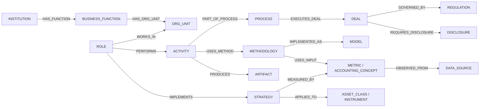
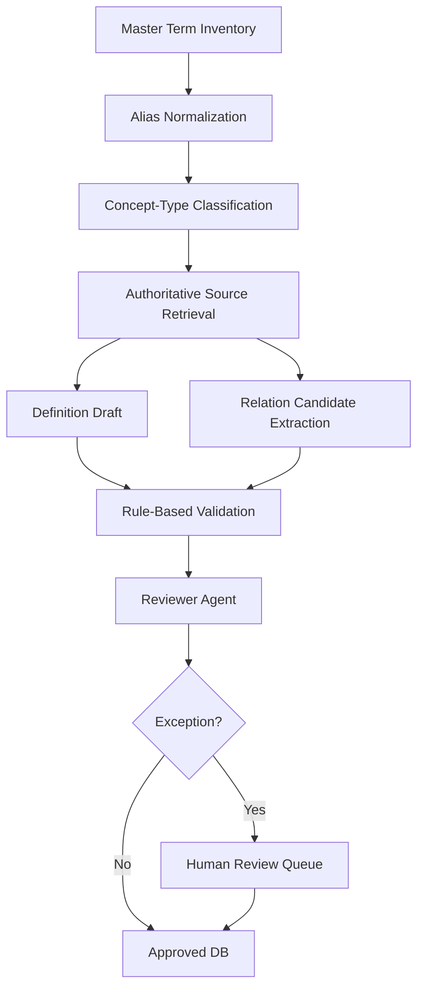

# 금융 직무·전략·방법론 용어집: 스키마 및 관계 구조 설계서

- 문서 버전: `v1.0`
- 기준일: `2026-08-12`
- 대상 범위: 증권사, 자산운용사, 투자은행, 리서치, 트레이딩, 리스크, 사모시장 및 공통 금융 실무 용어
- 권장 구현: **PostgreSQL 기반 관계형 저장소 + 그래프형 관계 테이블**. 검색 확장 시 `pg_trgm`, `pgvector`, OpenSearch 등을 선택적으로 추가

## 1. 설계 목적

이 DB의 목적은 단순한 가나다순 사전이 아니다. 사용자가 다음과 같은 경로를 양방향으로 탐색할 수 있게 하는 것이 목적이다.

```text
증권사 → Investment Banking → M&A Advisory → IB Analyst
      → Due Diligence → Valuation → DCF → WACC / FCFF
      → Pitch Book / Valuation Model / Information Memorandum
```

반대 방향 탐색도 가능해야 한다.

```text
DCF → 사용하는 직무 → IB / Equity Research / Asset Management / PE
    → 사용하는 거래 → M&A / IPO / 투자심사
    → 필요한 입력 → FCFF / WACC / Terminal Value
    → 결과물 → Enterprise Value / Equity Value / Valuation Model
```

따라서 하나의 트리보다 **다중 관계를 허용하는 지식 그래프(knowledge graph)**가 적합하다. FIBO 역시 금융 개념과 그 관계를 ontology로 표현하며, glossary나 data dictionary의 기반으로 사용할 수 있도록 제공된다. 참고 기준은 [S01], [S02]다.

## 2. 핵심 설계 원칙

1. **개념과 표기를 분리한다.** `Discounted Cash Flow`, `DCF`, `현금흐름할인법`은 하나의 concept에 연결된 여러 label이다.
2. **정확한 동의어와 기능상 대응어를 구분한다.** 한국의 `증권신고서`와 미국의 `Registration Statement`는 완전한 법적 동의어가 아니라 관할별 기능상 대응어다.
3. **직무, 전략, 방법론, 활동, 산출물을 분리한다.** IPO는 거래 유형, DCF는 방법론, Due Diligence는 활동, Pitch Book은 산출물이다.
4. **하나의 개념은 여러 경로에 연결될 수 있다.** DCF는 M&A, ECM, 리서치, 자산운용, PE에서 모두 사용된다.
5. **출처와 효력 시점을 저장한다.** 규제·공시·시장 관행은 국가와 시기에 따라 달라질 수 있다.
6. **정의와 관계는 모두 근거를 가진다.** agent가 생성한 문장을 그대로 사실로 취급하지 않는다.
7. **공식 정의와 실무 관용어를 분리한다.** 법령상 정의, 교과서적 정의, 국내 현업 용례가 다르면 각 층을 별도로 저장한다.
8. **원문 정의를 장문 복제하지 않는다.** 저작권과 라이선스를 고려해 자체 요약을 저장하고 출처 링크·인용 위치를 기록한다.

## 3. 개념 유형(Concept Type)

| 코드 | 유형 | 설명 | 예시 |
|---|---|---|---|
| `INSTITUTION` | 기관·시장참여자 | 금융회사, 투자자, 인프라 기관 | Securities Firm, Pension Fund, CCP |
| `BUSINESS_FUNCTION` | 사업·업무 기능 | 조직이 수행하는 기능 | Investment Banking, Equity Research |
| `ORG_UNIT` | 조직 단위 | 실제 부서·데스크·팀 | ECM Desk, Credit Trading Desk |
| `ROLE` | 직무·직책 | 사람이 맡는 역할 | IB Analyst, Portfolio Manager |
| `ASSET_CLASS` | 자산군 | 위험·수익 특성이 유사한 자산 범주 | Equity, Fixed Income, Real Estate |
| `INSTRUMENT` | 금융상품·계약 | 거래 가능한 상품 또는 계약 | Common Stock, CDS, Convertible Bond |
| `STRATEGY` | 투자전략 | 수익원·리스크 노출·운용 규칙 | Long/Short, Event-Driven, Risk Parity |
| `DEAL` | 거래·딜 유형 | 자금조달·인수·구조개편 유형 | IPO, M&A, Bond Offering |
| `PROCESS` | 프로세스 | 여러 단계로 이루어진 업무 흐름 | IPO Process, M&A Sell-Side Process |
| `ACTIVITY` | 개별 활동 | 프로세스 안에서 수행되는 작업 | Due Diligence, Bookbuilding |
| `METHODOLOGY` | 방법론 | 분석·평가·의사결정 방법 | DCF, Comparable Companies Analysis |
| `MODEL` | 모델 | 계산 구조나 모형 | Three-Statement Model, Factor Model |
| `METRIC` | 지표·비율·KPI | 측정 가능한 값 | ROIC, NIM, Tracking Error |
| `ACCOUNTING_CONCEPT` | 회계 개념·계정 | 재무제표 항목과 회계 개념 | Revenue, Goodwill, Deferred Tax Asset |
| `RISK` | 리스크 유형 | 손실 또는 불확실성의 유형 | Market Risk, Credit Risk, Model Risk |
| `EVENT` | 이벤트·촉매 | 투자 판단을 바꾸는 사건 | Earnings Surprise, Rating Downgrade |
| `ARTIFACT` | 산출물·문서 | 업무 결과로 생성되는 문서·파일 | Pitch Book, Research Report, Term Sheet |
| `DISCLOSURE` | 공시·제출서류 | 규제기관·시장에 제출되는 문서 | 사업보고서, 10-K, Prospectus |
| `REGULATION` | 법규·표준·의무 | 법률, 규정, 윤리·보고 기준 | Capital Markets Act, GIPS, Basel III |
| `MARKET_INFRA` | 시장 인프라·메커니즘 | 거래·청산·결제 구조 | Exchange, CSD, Order Book |
| `DATA_SOURCE` | 데이터 원천 | 공시, 가격, 추정치, 대체데이터 | DART, EDGAR, Consensus Estimates |
| `IDENTIFIER` | 식별자 | 법인·증권·보고서 식별 코드 | ISIN, LEI, CUSIP, DART corp_code |
| `TOOL_SKILL` | 도구·역량 | 업무 수행에 필요한 기술 | Excel Modeling, SQL, Python, Bloomberg |
| `SECTOR` | 산업·섹터 | 산업 분류 단위 | Banks, Semiconductors, SaaS |

### 3.1 유형 판정 예시

| 용어 | 잘못 분류하기 쉬운 유형 | 권장 유형 |
|---|---|---|
| IPO | 투자전략 | `DEAL` |
| M&A Advisory | 거래 | `BUSINESS_FUNCTION` |
| Due Diligence | 방법론 | `ACTIVITY` |
| DCF | 지표 | `METHODOLOGY` |
| Three-Statement Model | 방법론 | `MODEL` |
| Pitch Book | 프로세스 | `ARTIFACT` |
| Bookbuilding | 문서 | `ACTIVITY` |
| Fundamental Long/Short | 자산군 | `STRATEGY` |
| EBITDA | 회계기준상 필수 계정 | `METRIC` 또는 비GAAP 성과지표 |

## 4. 상위 관계 구조



## 5. 관계 타입 사전

### 5.1 계층·구성 관계

| 관계 | 방향 | 허용 예시 |
|---|---|---|
| `IS_A` | 하위 → 상위 | Merger Arbitrage → Event-Driven Strategy |
| `HAS_SUBTYPE` | 상위 → 하위 | Due Diligence → Financial DD |
| `PART_OF` | 부분 → 전체 | ECM → Investment Banking |
| `HAS_PART` | 전체 → 부분 | Investment Banking → ECM |
| `INSTANCE_OF` | 개별 사례 → 개념 | 특정 펀드 → Hedge Fund |

### 5.2 조직·직무 관계

| 관계 | 방향 | 예시 |
|---|---|---|
| `HAS_FUNCTION` | Institution → Business Function | Securities Firm → Investment Banking |
| `HAS_ORG_UNIT` | Function → Org Unit | Sales & Trading → Credit Trading Desk |
| `WORKS_IN` | Role → Function/Org Unit | Credit Analyst → Credit Research |
| `PERFORMS` | Role → Activity | IB Analyst → Comparable Companies Analysis |
| `RESPONSIBLE_FOR` | Role → Process/Artifact/Risk | PM → Portfolio Construction |
| `REQUIRES_SKILL` | Role/Activity → Tool/Skill | Quant Researcher → Python |
| `USES_TOOL` | Role/Activity → Tool/Skill | Equity Research Analyst → Financial Data Terminal |

### 5.3 전략·상품 관계

| 관계 | 방향 | 예시 |
|---|---|---|
| `IMPLEMENTS_STRATEGY` | Role/Fund → Strategy | Portfolio Manager → Fundamental Long-Only |
| `APPLIES_TO` | Strategy → Asset/Instrument | Merger Arbitrage → Target Company Equity |
| `TARGETS_RETURN_DRIVER` | Strategy → Metric/Event/Factor | Momentum Strategy → Price Momentum |
| `TAKES_EXPOSURE_TO` | Strategy/Instrument → Risk/Factor | Carry Trade → Interest-Rate Differential |
| `HEDGES_WITH` | Strategy/Risk → Instrument | FX Risk → Currency Forward |
| `BENCHMARKED_TO` | Strategy/Fund → Market/Index | Index Fund → KOSPI 200 |

### 5.4 딜·프로세스 관계

| 관계 | 방향 | 예시 |
|---|---|---|
| `EXECUTES_DEAL` | Process/Function → Deal | ECM → IPO |
| `PART_OF_PROCESS` | Activity → Process | Bookbuilding → IPO Process |
| `PRECEDES` | Activity → Activity | Due Diligence → Signing |
| `FOLLOWS` | Activity → Activity | Closing → Signing |
| `REQUIRES` | Deal/Activity → Activity/Artifact | M&A → Due Diligence |
| `PRODUCES` | Activity/Process → Artifact | Client Pitch → Pitch Book |
| `CONTAINS` | Artifact → Concept/Artifact | Pitch Book → Valuation Section |
| `REVIEWED_BY` | Artifact → Role | Valuation Model → Associate/VP |
| `GOVERNED_BY` | Deal/Process → Regulation | IPO → Securities Regulation |
| `REQUIRES_DISCLOSURE` | Deal → Disclosure | IPO → Prospectus |

### 5.5 분석·계산 관계

| 관계 | 방향 | 예시 |
|---|---|---|
| `USES_METHOD` | Activity/Strategy → Methodology | Equity Research → DCF |
| `IMPLEMENTED_AS` | Methodology → Model | DCF → DCF Model |
| `INPUT_TO` | Metric/Concept → Methodology/Model | WACC → DCF |
| `OUTPUT_OF` | Metric/Artifact → Methodology/Model | Enterprise Value → DCF |
| `DERIVED_FROM` | Metric → Metric/Accounting Concept | ROIC → NOPAT and Invested Capital |
| `MEASURES` | Metric → Concept/Risk/Performance | Tracking Error → Active Risk |
| `HAS_FORMULA` | Metric/Method → Formula record | CAGR → CAGR Formula |
| `SENSITIVE_TO` | Output/Metric → Assumption | DCF Value → WACC |

### 5.6 의미·관할 관계

| 관계 | 용도 | 예시 |
|---|---|---|
| `RELATED_TO` | 일반 연관 | Enterprise Value ↔ Equity Value |
| `CONTRASTS_WITH` | 대조 개념 | Buy-Side ↔ Sell-Side |
| `OFTEN_CONFUSED_WITH` | 혼동 방지 | Revenue ↔ Billings |
| `FUNCTIONAL_EQUIVALENT_TO` | 관할별 기능 대응 | 증권신고서 ↔ Registration Statement |
| `DEFINED_BY` | 권위 있는 정의 주체 | CET1 → Basel Framework |
| `DISCLOSED_IN` | 지표의 주요 공시 위치 | Segment Revenue → Segment Note |
| `VALID_IN_JURISDICTION` | 관할 범위 | 10-K → United States |

> `SYNONYM_OF`는 가능한 한 관계 테이블이 아니라 label/alias 테이블에서 처리한다. 서로 다른 법적 개념을 편의상 동의어로 합치지 않는다.

## 6. 관계 타입별 허용 타입 제약

| Subject type | Predicate | Object type |
|---|---|---|
| `INSTITUTION` | `HAS_FUNCTION` | `BUSINESS_FUNCTION` |
| `BUSINESS_FUNCTION` | `HAS_ORG_UNIT` | `ORG_UNIT` |
| `ROLE` | `WORKS_IN` | `BUSINESS_FUNCTION`, `ORG_UNIT` |
| `ROLE` | `PERFORMS` | `ACTIVITY`, `PROCESS` |
| `ACTIVITY` | `USES_METHOD` | `METHODOLOGY`, `MODEL` |
| `ACTIVITY`, `PROCESS` | `PRODUCES` | `ARTIFACT`, `DISCLOSURE` |
| `STRATEGY` | `APPLIES_TO` | `ASSET_CLASS`, `INSTRUMENT` |
| `STRATEGY` | `MEASURED_BY` | `METRIC` |
| `DEAL` | `REQUIRES` | `ACTIVITY`, `ARTIFACT` |
| `DEAL` | `GOVERNED_BY` | `REGULATION` |
| `METRIC`, `ACCOUNTING_CONCEPT` | `INPUT_TO` | `METHODOLOGY`, `MODEL` |
| `METRIC` | `DERIVED_FROM` | `METRIC`, `ACCOUNTING_CONCEPT` |
| `DISCLOSURE` | `FILED_WITH` | `INSTITUTION`, `MARKET_INFRA` |

DB 입력 단계에서 이 표를 validation rule로 사용한다. `ROLE → INPUT_TO → DCF` 같은 비정상 edge는 저장 전에 차단한다.

## 7. 권장 관계형 스키마

### 7.1 개념 테이블

```sql
CREATE TABLE concept (
    concept_id          UUID PRIMARY KEY,
    concept_code        TEXT UNIQUE NOT NULL,
    concept_type        TEXT NOT NULL,
    canonical_name_en   TEXT NOT NULL,
    canonical_name_ko   TEXT,
    short_definition_ko TEXT,
    status              TEXT NOT NULL DEFAULT 'draft',
    jurisdiction_scope  TEXT[] NOT NULL DEFAULT ARRAY['GLOBAL'],
    valid_from          DATE,
    valid_to            DATE,
    created_at          TIMESTAMPTZ NOT NULL DEFAULT now(),
    updated_at          TIMESTAMPTZ NOT NULL DEFAULT now(),
    CHECK (status IN ('draft','review','approved','deprecated'))
);
```

### 7.2 표기·약어·별칭

```sql
CREATE TABLE concept_label (
    label_id        UUID PRIMARY KEY,
    concept_id      UUID NOT NULL REFERENCES concept(concept_id),
    language_code   TEXT NOT NULL,
    label_text      TEXT NOT NULL,
    normalized_text TEXT NOT NULL,
    label_type      TEXT NOT NULL,
    jurisdiction    TEXT,
    is_preferred    BOOLEAN NOT NULL DEFAULT false,
    UNIQUE (concept_id, language_code, label_text, jurisdiction),
    CHECK (label_type IN (
        'preferred','acronym','abbreviation','alias',
        'legacy','colloquial','translation'
    ))
);
```

### 7.3 관계 타입과 edge

```sql
CREATE TABLE relation_type (
    predicate_code       TEXT PRIMARY KEY,
    inverse_predicate    TEXT,
    is_symmetric         BOOLEAN NOT NULL DEFAULT false,
    is_transitive        BOOLEAN NOT NULL DEFAULT false,
    description_ko       TEXT NOT NULL
);

CREATE TABLE concept_relation (
    relation_id      UUID PRIMARY KEY,
    subject_id       UUID NOT NULL REFERENCES concept(concept_id),
    predicate_code   TEXT NOT NULL REFERENCES relation_type(predicate_code),
    object_id        UUID NOT NULL REFERENCES concept(concept_id),
    jurisdiction     TEXT,
    valid_from       DATE,
    valid_to         DATE,
    confidence       NUMERIC(4,3) CHECK (confidence BETWEEN 0 AND 1),
    review_status    TEXT NOT NULL DEFAULT 'draft',
    created_by       TEXT NOT NULL,
    UNIQUE(subject_id, predicate_code, object_id, jurisdiction)
);
```

### 7.4 출처·근거

```sql
CREATE TABLE source (
    source_id          UUID PRIMARY KEY,
    source_code        TEXT UNIQUE NOT NULL,
    title              TEXT NOT NULL,
    publisher          TEXT NOT NULL,
    source_type        TEXT NOT NULL,
    url                TEXT NOT NULL,
    jurisdiction       TEXT,
    authority_tier     SMALLINT NOT NULL,
    publication_date   DATE,
    retrieved_at       DATE NOT NULL,
    license_note       TEXT
);

CREATE TABLE evidence (
    evidence_id        UUID PRIMARY KEY,
    source_id          UUID NOT NULL REFERENCES source(source_id),
    locator            TEXT,
    excerpt_hash       TEXT,
    paraphrase_ko      TEXT,
    supports_type      TEXT NOT NULL,
    supports_id        UUID NOT NULL,
    CHECK (supports_type IN ('concept','definition','relation','formula'))
);
```

### 7.5 정의 버전

```sql
CREATE TABLE concept_definition (
    definition_id      UUID PRIMARY KEY,
    concept_id         UUID NOT NULL REFERENCES concept(concept_id),
    definition_layer   TEXT NOT NULL,
    body_ko            TEXT NOT NULL,
    body_en            TEXT,
    jurisdiction       TEXT,
    valid_from         DATE,
    valid_to           DATE,
    confidence         NUMERIC(4,3),
    review_status      TEXT NOT NULL DEFAULT 'draft',
    model_name         TEXT,
    prompt_version     TEXT,
    created_at         TIMESTAMPTZ NOT NULL DEFAULT now(),
    CHECK (definition_layer IN (
        'one_line','core','practical','legal','formula',
        'example','limitations','confusion_note'
    ))
);
```

### 7.6 공식·계산 규칙

```sql
CREATE TABLE formula (
    formula_id          UUID PRIMARY KEY,
    concept_id          UUID NOT NULL REFERENCES concept(concept_id),
    formula_name        TEXT NOT NULL,
    expression_latex    TEXT,
    expression_python   TEXT,
    unit_rule           TEXT,
    frequency_rule      TEXT,
    null_handling_rule  TEXT,
    sign_convention     TEXT,
    test_case_json      JSONB,
    review_status       TEXT NOT NULL DEFAULT 'draft'
);
```

### 7.7 리뷰 이력

```sql
CREATE TABLE review_event (
    review_id        UUID PRIMARY KEY,
    target_type      TEXT NOT NULL,
    target_id        UUID NOT NULL,
    reviewer         TEXT NOT NULL,
    decision         TEXT NOT NULL,
    comment          TEXT,
    reviewed_at      TIMESTAMPTZ NOT NULL DEFAULT now(),
    CHECK (decision IN ('approve','revise','reject','deprecate'))
);
```

## 8. ID 규칙

권장 형식은 사람이 읽는 코드와 UUID를 병행하는 것이다.

```text
UUID: 내부 primary key
concept_code: FIN-METHOD-DCF
concept_code: FIN-DEAL-IPO
concept_code: FIN-ART-PITCH_BOOK
concept_code: FIN-ACT-DUE_DILIGENCE
```

권장 prefix:

| Prefix | 유형 |
|---|---|
| `INST` | Institution |
| `FUNC` | Business Function |
| `ROLE` | Role |
| `ASSET` | Asset Class |
| `INSTR` | Instrument |
| `STRAT` | Strategy |
| `DEAL` | Deal |
| `PROC` | Process |
| `ACT` | Activity |
| `METHOD` | Methodology |
| `MODEL` | Model |
| `METRIC` | Metric |
| `ACCT` | Accounting Concept |
| `RISK` | Risk |
| `EVENT` | Event |
| `ART` | Artifact |
| `DISC` | Disclosure |
| `REG` | Regulation |
| `DATA` | Data Source |
| `ID` | Identifier |
| `SECTOR` | Sector |

코드에는 현재 조직명이나 규제기관명을 과도하게 넣지 않는다. 기관명 변경 시 concept_code가 깨지기 때문이다.

## 9. 대표 예시 그래프

### 9.1 DCF

```text
DCF [METHODOLOGY]
  IS_A → Intrinsic Valuation
  USED_BY ← IB Analyst / Equity Research Analyst / Investment Analyst
  USED_IN ← M&A / IPO / Fundamental Investing
  INPUT_TO ← FCFF / WACC / Terminal Growth Rate / Exit Multiple
  OUTPUT_OF → Enterprise Value
  IMPLEMENTED_AS → DCF Model
  PRODUCES → Valuation Range
  RELATED_TO → SOTP / Comparable Companies / Precedent Transactions
```

### 9.2 Pitch Book

```text
Pitch Book [ARTIFACT]
  PRODUCED_BY ← Client Pitch
  CREATED_BY ← IB Analyst
  USED_IN ← M&A / ECM / DCM / Financing Proposal
  CONTAINS → Company Overview / Market Update / Valuation / Deal Structure
  MAY_CONTAIN → DCF / Trading Comps / Transaction Comps
```

### 9.3 Due Diligence

```text
Due Diligence [ACTIVITY]
  HAS_SUBTYPE → Financial / Commercial / Legal / Tax / Technical / ESG DD
  USED_IN ← M&A / IPO / Private Equity / Private Credit
  PRODUCES → DD Report / Red Flag Report
  AFFECTS → Valuation / Purchase Price / Deal Structure / Covenants
```

### 9.4 Fundamental Long/Short

```text
Fundamental Long/Short [STRATEGY]
  IS_A → Equity Long/Short
  APPLIES_TO → Equity
  USES_METHOD → Company Analysis / Valuation / Catalyst Analysis
  MEASURED_BY → Gross Exposure / Net Exposure / Alpha / Drawdown
  HEDGES_WITH → Short Position / Index Futures
```

### 9.5 IPO

```text
IPO [DEAL]
  IS_A → Equity Offering
  EXECUTED_BY ← ECM / Syndicate / Underwriters
  HAS_PROCESS → IPO Process
  REQUIRES → Due Diligence / Bookbuilding / Roadshow
  REQUIRES_DISCLOSURE → Prospectus / 증권신고서
  PRODUCES → Offer Price / Allocation / Listed Shares
```

## 10. 검색·탐색 쿼리 예시

### 10.1 특정 직무가 사용하는 방법론

```sql
SELECT m.canonical_name_en, m.canonical_name_ko
FROM concept r
JOIN concept_relation e ON e.subject_id = r.concept_id
JOIN concept m ON m.concept_id = e.object_id
WHERE r.concept_code = 'FIN-ROLE-IB_ANALYST'
  AND e.predicate_code IN ('PERFORMS','USES_METHOD');
```

### 10.2 DCF와 2-hop 이내로 연결된 직무·딜·지표

재귀 CTE 또는 graph extension을 사용한다.

```sql
WITH RECURSIVE graph AS (
  SELECT subject_id, predicate_code, object_id, 1 AS depth
  FROM concept_relation
  WHERE subject_id = :dcf_id OR object_id = :dcf_id
  UNION ALL
  SELECT e.subject_id, e.predicate_code, e.object_id, g.depth + 1
  FROM concept_relation e
  JOIN graph g ON e.subject_id = g.object_id
  WHERE g.depth < 2
)
SELECT * FROM graph;
```

## 11. 검색 인덱스

- `concept_label.normalized_text`: B-tree + trigram index
- 한국어 형태소 검색이 필요하면 OpenSearch/Nori 또는 PostgreSQL용 별도 tokenizer 검토
- 의미 검색은 concept 단위 embedding만 저장하고, 정의 원문 전체를 무차별 embedding하지 않는다.
- `concept_relation(subject_id, predicate_code)`와 `(object_id, predicate_code)` 복합 인덱스 생성
- 대량 분석은 edge 전체가 아니라 필요한 concept subset만 조회

```sql
CREATE EXTENSION IF NOT EXISTS pg_trgm;
CREATE INDEX idx_label_trgm
ON concept_label USING gin (normalized_text gin_trgm_ops);

CREATE INDEX idx_edge_subject_predicate
ON concept_relation(subject_id, predicate_code);

CREATE INDEX idx_edge_object_predicate
ON concept_relation(object_id, predicate_code);
```

## 12. 관할·시점 관리

### 12.1 관할

```text
GLOBAL: 국제적으로 통용되는 일반 개념
KR: 한국 법규·시장 관행
US: 미국 법규·시장 관행
EU: EU 규제·시장 관행
```

동일 용어라도 관할에 따라 별도 definition record를 둘 수 있다.

```text
Prospectus
  global practical definition
  KR legal/practical note
  US legal/practical note
```

### 12.2 시점

- 규정·결제주기·공시서식처럼 변할 수 있는 항목은 `valid_from`, `valid_to`를 필수로 둔다.
- 과거 명칭은 삭제하지 않고 `legacy` label 또는 `deprecated` concept로 보존한다.
- 최신 상태와 당시 상태를 구분하기 위해 definition과 relation 모두 versioning한다.

## 13. 중복·동음이의어 처리

| 표현 | 처리 원칙 |
|---|---|
| `PI` | Principal Investment, Proprietary Investment 등 의미별 concept 분리 |
| `NAV` | 기본 concept는 Net Asset Value. 부동산 valuation method와의 연결은 관계로 표현 |
| `DD` | Due Diligence의 약어로 저장하되, 다른 문맥 후보가 있으면 검색에서 disambiguation |
| `Spread` | Bid-Ask Spread, Credit Spread, Option Spread를 분리 |
| `Yield` | Current Yield, YTM, Earnings Yield 등을 분리 |
| `Coverage` | Research Coverage, Interest Coverage, Coverage Banker를 분리 |

## 14. 출처 권위 등급

| Tier | 출처 | 사용 방식 |
|---|---|---|
| 1 | 법령, 규제기관, 표준설정기관, 공식 공시 | 법적·표준 정의의 최우선 근거 |
| 2 | CFA, FINRA, BIS, ISDA, GIPS, FIBO, O*NET, NCS 등 전문기관 | 직무·방법론·시장 표준 근거 |
| 3 | 거래소, 업계협회, 대형 데이터 제공사, 전문 교육기관 | 실무 관행·분류 보완 |
| 4 | 회사 채용공고, 리서치 보고서, 실무 블로그 | 현업 용례 확인용. 단독 정의 근거로 사용 금지 |

## 15. 자동 구축 파이프라인



### 자동화 가능한 부분

- 대소문자·하이픈·복수형 정규화
- 약어 후보 생성
- concept type 1차 분류
- 공식 출처 검색과 메타데이터 수집
- 관계 후보 추출
- 중복 후보 clustering
- formula test 실행

### 사람 검수가 필요한 부분

- 서로 다른 법적 개념의 병합 여부
- 한국어 번역의 자연스러움과 업계 관행
- 관할별 대응 관계
- 실무상 경계가 불명확한 전략 분류
- 법적·규제적 정의

## 16. 품질 검증 규칙

1. approved concept는 최소 1개의 Tier 1~2 evidence를 가져야 한다.
2. 법적·규제 용어는 해당 관할의 Tier 1 출처가 없으면 `review` 상태를 벗어나지 못한다.
3. formula가 있는 metric은 최소 2개 단위 테스트를 통과해야 한다.
4. 한 concept에 preferred English label은 관할별 최대 1개다.
5. 약어만 있고 full name이 없는 concept는 승인하지 않는다.
6. `IS_A` cycle을 허용하지 않는다.
7. symmetric relation이 아닌데 역방향 edge를 자동 생성하지 않는다.
8. DCF, IRR, EBITDA처럼 정의 변형이 많은 용어는 limitations 또는 convention note를 필수로 둔다.
9. LLM confidence는 근거 수준을 대체하지 않는다. confidence는 source authority, source agreement, ambiguity를 조합해 계산한다.
10. 출처 간 충돌은 한쪽을 삭제하지 말고 `conflict_note`와 관할·시점 차이를 기록한다.

## 17. MVP 권장 범위

### 1단계: 핵심 300~500 concepts

- 증권사: IB, 리서치, S&T, 리스크
- 자산운용사: 주식·채권·퀀트·리스크·성과분석
- 공통: 기업가치평가, 포트폴리오, 공시, 재무제표, 금융상품

### 2단계: 산업 KPI와 대체투자

- 은행, 보험, 반도체, SaaS, 인터넷, 소비재, 항공, 에너지
- PE, private credit, real estate, infrastructure

### 3단계: 규제·국가 확장

- 한국/미국 법적 용어 분리
- 공시 서식과 identifier 연결
- EU 및 기타 주요 시장 확장

## 18. 구현 선택

### PostgreSQL부터 시작할 이유

- concept·label·source·version 관리가 관계형에 적합하다.
- 수십만 edge까지는 일반적인 인덱스와 recursive CTE로 충분하다.
- transaction과 review workflow를 구현하기 쉽다.
- 향후 Neo4j/RDF로 export할 수 있다.

### Graph DB가 필요한 시점

- 수백만 edge의 다중-hop 탐색이 핵심 제품 기능이 될 때
- graph algorithm, community detection, path ranking을 상시 수행할 때
- RDF/OWL reasoning과 외부 ontology 정합성이 필요할 때

초기에는 `PostgreSQL + edge table`이 유지비와 개발 난이도 측면에서 합리적이다.

## 19. 레퍼런스

- **[S01]** EDM Council, Financial Industry Business Ontology (FIBO): https://spec.edmcouncil.org/fibo/
- **[S02]** EDM Council, FIBO Vocabulary: https://spec.edmcouncil.org/fibo/page/vocabulary
- **[S03]** CFA Institute, CFA Program Glossary: https://www.cfainstitute.org/programs/cfa-program/candidate-resources/glossary-terms
- **[S04]** CFA Institute, Investment Foundations Certificate: https://www.cfainstitute.org/programs/investment-foundations-certificate
- **[S05]** CFA Institute, Refresher Readings: https://www.cfainstitute.org/insights/professional-learning/refresher-readings
- **[S06]** CFA Institute, Definitions for Responsible Investment Approaches: https://rpc.cfainstitute.org/research/reports/2023/definitions-for-responsible-investment-approaches
- **[S07]** FINRA, Series 79 Investment Banking Representative Exam: https://www.finra.org/registration-exams-ce/qualification-exams/series79
- **[S08]** FINRA, Securities Industry Essentials Exam: https://www.finra.org/registration-exams-ce/qualification-exams/securities-industry-essentials-exam
- **[S09]** SEC Investor.gov, Investment Glossary: https://www.investor.gov/introduction-investing/investing-basics/glossary
- **[S10]** O*NET, Financial and Investment Analysts: https://www.onetonline.org/link/summary/13-2051.00
- **[S11]** O*NET, Investment Fund Managers: https://www.onetonline.org/link/details/11-3031.03
- **[S12]** O*NET, Financial Quantitative Analysts: https://www.onetonline.org/link/summary/13-2099.01
- **[S13]** O*NET, Financial Risk Specialists: https://www.onetonline.org/link/summary/13-2054.00
- **[S14]** NCS, 금융·보험/자산운용 관련 능력단위: https://www.ncs.go.kr/
- **[S15]** 금융투자교육원, 금융투자 직무역량 체계: https://www.kifin.or.kr/intro/intro02.do
- **[S16]** XBRL International, Taxonomies: https://www.xbrl.org/the-standard/what/key-concepts-in-xbrl/taxonomies/
- **[S17]** IFRS Foundation, Accounting Standards Navigator: https://www.ifrs.org/issued-standards/list-of-standards/
- **[S18]** Global Investment Performance Standards (GIPS): https://www.gipsstandards.org/standards/gips-standards-for-firms/
- **[S19]** Basel Committee, Basel Framework: https://www.bis.org/basel_framework/
- **[S20]** ISDA, Derivatives Glossary and Definitions: https://www.isda.org/1985/01/01/glossary/
- **[S21]** MSCI, Index Glossary: https://www.msci.com/index/methodology/latest/IndexGlossary
- **[S22]** ILPA, Private Equity Glossary: https://ilpa.org/resources-tools/private-equity-101/private-equity-glossary/
- **[S23]** CAIA, Fundamentals of Alternative Investments: https://caia.org/index.php/content/fundamentals-alternative-investments-learning-modules
- **[S24]** Preqin Academy, Industry Definitions: https://www.preqin.com/academy/industry-definitions
- **[S25]** 금융감독원 DART, 기업공시 길라잡이: https://dart.fss.or.kr/info/main.do?menu=210
- **[S26]** 한국거래소 정보데이터시스템/투자자 교육: https://data.krx.co.kr/
- **[S27]** OpenDART: https://opendart.fss.or.kr/
- **[S28]** SASB Standards Navigator: https://navigator.sasb.ifrs.org/
