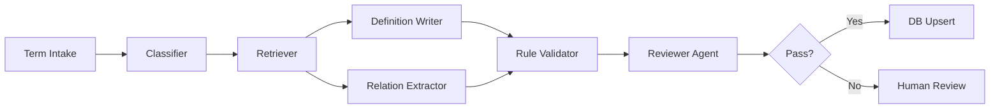

# 금융 용어별 의미 생성 Agent 명세서

- 문서 버전: `v1.0`
- 기준일: `2026-08-12`
- 목적: master inventory의 각 용어를 **근거 기반·구조화된 설명**으로 확장하고, ontology 관계 후보를 생성하는 agent 운영 규격

## 1. Agent의 역할

Agent는 단순 번역기가 아니다. 각 용어에 대해 다음을 수행한다.

1. 용어의 정확한 의미와 문맥을 식별한다.
2. `직무/전략/딜/방법론/활동/산출물/지표` 중 concept type을 확정한다.
3. 공신력 있는 출처를 찾고 관할·시점을 확인한다.
4. 한국어로 자체 요약된 정의를 작성한다.
5. 사용 직무, 사용 프로세스, 입력·출력, 관련 용어를 관계 후보로 만든다.
6. 공식·계산 규칙이 있으면 코드로 검증 가능한 형태를 만든다.
7. 모호하거나 충돌하는 항목을 사람 검수 queue로 보낸다.

## 2. 권장 Agent 구성



비용을 줄이려면 하나의 대형 agent가 전부 수행하게 하지 않는다.

- **Classifier:** 소형 모델 또는 규칙 기반
- **Retriever:** 검색/API/RAG
- **Writer:** 중형 모델
- **Formula Validator:** Python/SQL
- **Reviewer:** 중형 모델 + 규칙
- **Human Review:** 충돌·법적 정의·낮은 confidence만 처리

## 3. 입력 스키마

```json
{
  "concept_code": "FIN-METHOD-DCF",
  "canonical_name_en": "Discounted Cash Flow",
  "canonical_name_ko": "현금흐름할인법",
  "aliases": ["DCF", "할인현금흐름법"],
  "provisional_type": "METHODOLOGY",
  "jurisdictions": ["GLOBAL", "KR", "US"],
  "domain_hints": ["Investment Banking", "Equity Research", "Asset Management"],
  "neighbor_terms": ["FCFF", "WACC", "Terminal Value", "Enterprise Value"],
  "source_whitelist": ["CFA Institute", "FINRA", "SEC", "FIBO"],
  "as_of_date": "2026-08-12"
}
```

### 필수 입력

- `concept_code`
- 영어 canonical name
- provisional concept type
- 기준일

### 선택 입력

- 한국어 명칭
- 약어·별칭
- 예상 사용 영역
- 기존 neighbor concept
- 관할
- 허용·금지 출처

## 4. 출력 스키마

```json
{
  "concept_code": "FIN-METHOD-DCF",
  "canonical_name_en": "Discounted Cash Flow",
  "canonical_name_ko": "현금흐름할인법",
  "aliases": [
    {"label": "DCF", "type": "acronym", "language": "en"},
    {"label": "할인현금흐름법", "type": "alias", "language": "ko"}
  ],
  "concept_type": "METHODOLOGY",
  "one_line_definition_ko": "미래 현금흐름을 위험을 반영한 할인율로 현재가치화해 자산 또는 기업의 가치를 추정하는 내재가치 평가 방법이다.",
  "core_definition_ko": "...",
  "practical_context_ko": "...",
  "why_it_matters_ko": "...",
  "used_by_roles": ["IB Analyst", "Equity Research Analyst", "Investment Analyst"],
  "used_in_functions": ["M&A Advisory", "Equity Research", "Fundamental Equity Investment"],
  "used_in_deals_or_strategies": ["M&A", "IPO", "Fundamental Long-Only"],
  "inputs": ["FCFF", "WACC", "Terminal Growth Rate"],
  "outputs": ["Enterprise Value", "Equity Value", "Valuation Range"],
  "formula": {
    "latex": "EV=\\sum_{t=1}^n \\frac{FCFF_t}{(1+WACC)^t}+\\frac{TV_n}{(1+WACC)^n}",
    "python_expression": null,
    "conventions": ["mid-year convention 여부 명시", "terminal value 방식 명시"]
  },
  "workflow_steps": ["Forecast", "FCF calculation", "Discount rate", "Terminal value", "Sensitivity"],
  "interpretation_rules": ["WACC가 높아지면 통상 현재가치는 낮아진다."],
  "limitations": ["장기 가정에 민감하다.", "terminal value 비중이 과도할 수 있다."],
  "example_ko": "...",
  "relations": [
    {"predicate": "IS_A", "object": "Intrinsic Valuation"},
    {"predicate": "INPUT_TO", "subject": "WACC"},
    {"predicate": "IMPLEMENTED_AS", "object": "DCF Model"}
  ],
  "confusion_notes": [
    {"term": "Dividend Discount Model", "difference": "배당을 직접 할인한다는 점이 다르다."}
  ],
  "jurisdiction_notes": [],
  "sources": [
    {
      "source_code": "S03",
      "title": "CFA Program Glossary",
      "publisher": "CFA Institute",
      "url": "https://www.cfainstitute.org/programs/cfa-program/candidate-resources/glossary-terms",
      "locator": "search term: discounted cash flow",
      "authority_tier": 2,
      "supports": ["core_definition", "relations"]
    }
  ],
  "confidence": {
    "overall": 0.93,
    "type": 0.99,
    "definition": 0.95,
    "relations": 0.86,
    "formula": 0.98
  },
  "review_flags": []
}
```

## 5. 정의 작성 규칙

### 5.1 정의의 층

| 층 | 길이 | 내용 |
|---|---:|---|
| `one_line` | 1문장 | 초심자가 바로 이해할 핵심 정의 |
| `core` | 3~6문장 | 개념의 경계, 작동 방식, 핵심 요소 |
| `practical` | 2~5문장 | 실제 어느 직무·딜·전략에서 어떻게 쓰는지 |
| `why_it_matters` | 1~3문장 | 의사결정에서 왜 중요한지 |
| `formula` | 필요시 | 수식, 변수 정의, 단위·부호·기간 규칙 |
| `example` | 1개 | 숫자 또는 업무 상황 예시 |
| `limitations` | 2개 이상 | 오해·모델 위험·적용 한계 |
| `confusion_note` | 필요시 | 비슷한 용어와 차이 |

### 5.2 문체

- 한국어 중심, 영어 원어와 약어를 병기한다.
- 정의 첫 문장은 동어반복을 피한다.
- `무엇인지 → 어디서 쓰는지 → 어떻게 작동하는지` 순서로 쓴다.
- 과도한 홍보성 문구를 쓰지 않는다.
- 법률 자문이나 투자 권고처럼 단정하지 않는다.
- “보통”, “통상”, “문맥에 따라”가 필요한 경우 조건을 명시한다.

### 5.3 금지 예시

```text
DCF는 DCF를 사용해 기업가치를 평가하는 방법이다.   # 동어반복
Pitch book은 IB에서 사용하는 책이다.              # 지나치게 피상적
EBITDA는 항상 현금흐름과 같다.                     # 사실 오류
SOTP는 M&A에서만 사용된다.                         # 범위 오류
IPO는 투자전략이다.                                # 유형 오류
```

## 6. 출처 검색 규칙

### 6.1 우선순위

1. 법령·규제기관·표준설정기관
2. CFA, FINRA, BIS, ISDA, GIPS, FIBO, O*NET, NCS 등 전문기관
3. 거래소, 업계협회, 공식 교육기관
4. 기업 공시·채용자료·실무 문서
5. 일반 블로그와 커뮤니티는 용례 탐색용으로만 사용

### 6.2 영역별 기본 출처

| 영역 | 우선 출처 |
|---|---|
| 개념 관계·금융상품 | FIBO [S01][S02] |
| 투자·가치평가·포트폴리오 | CFA [S03][S04][S05] |
| IB 직무·증권 인수 | FINRA Series 79 [S07] |
| 일반 증권시장 용어 | SEC Investor.gov [S09], FINRA [S08] |
| 직무·업무 task | O*NET [S10]~[S13], NCS [S14], 금융투자교육원 [S15] |
| 회계·재무제표 | IFRS [S17], XBRL [S16] |
| 성과측정 | GIPS [S18] |
| 은행 규제지표 | Basel Framework [S19] |
| 파생상품·계약 | ISDA [S20] |
| 인덱스·factor | MSCI [S21] |
| PE·사모시장 | ILPA [S22], CAIA [S23], Preqin [S24] |
| 한국 공시·시장용어 | DART [S25], KRX [S26], OpenDART [S27] |
| 산업별 지속가능성 KPI | SASB [S28] |

### 6.3 출처 사용 규칙

- 정의를 장문 복사하지 않고 자체 문장으로 요약한다.
- URL, 발행기관, 문서명, 확인 위치를 저장한다.
- 법적 정의가 필요한 경우 해당 관할의 공식 원문을 반드시 포함한다.
- 최신성이 필요한 규정·공시·결제·시장구조는 기준일 현재 내용을 다시 확인한다.
- 서로 다른 출처가 다르면 `source_conflict` flag를 만든다.

## 7. Concept Type 분류 Prompt

```text
당신은 금융 실무 ontology 분류기다.

입력된 용어를 아래 유형 중 정확히 하나의 primary type으로 분류하라.
INSTITUTION, BUSINESS_FUNCTION, ORG_UNIT, ROLE, ASSET_CLASS, INSTRUMENT,
STRATEGY, DEAL, PROCESS, ACTIVITY, METHODOLOGY, MODEL, METRIC,
ACCOUNTING_CONCEPT, RISK, EVENT, ARTIFACT, DISCLOSURE, REGULATION,
MARKET_INFRA, DATA_SOURCE, IDENTIFIER, TOOL_SKILL, SECTOR.

규칙:
1. IPO는 DEAL이다.
2. Due Diligence는 ACTIVITY다.
3. DCF는 METHODOLOGY다.
4. Pitch Book은 ARTIFACT다.
5. EBITDA는 원칙적으로 METRIC이다. 공식 회계 계정으로 단정하지 않는다.
6. 하나의 용어가 여러 의미를 가지면 의미별 concept 분리를 제안한다.
7. 한국과 미국에서 법적 의미가 다르면 jurisdiction split을 제안한다.

출력 JSON:
{
  "primary_type": "...",
  "secondary_tags": [],
  "disambiguation_required": false,
  "candidate_senses": [],
  "reason_ko": "...",
  "confidence": 0.0
}

입력 용어:
{TERM_PAYLOAD}
```

## 8. 단일 용어 정의 생성 Prompt

```text
당신은 증권사·자산운용사 실무 용어 지식베이스를 구축하는 금융 ontology editor다.
입력된 용어에 대해 근거 기반의 한국어 설명과 관계 후보를 생성하라.

[목표]
- 초심자가 이해할 수 있으면서 현업 분류를 왜곡하지 않는 정의
- 직무, 전략, 딜, 방법론, 산출물의 계층을 엄격히 구분
- 공식 출처에 근거한 관계 후보 생성
- 계산 가능한 항목은 LLM 계산이 아니라 formula/code 규칙으로 표현

[필수 절차]
1. 용어의 의미를 식별하고 동음이의어 여부를 판정한다.
2. primary concept type을 확정한다.
3. Tier 1~2 출처를 우선 검색한다.
4. one-line/core/practical 정의를 작성한다.
5. 사용 직무·기능·전략·딜·프로세스를 연결한다.
6. 입력·출력·공식이 있으면 구조화한다.
7. 혼동 용어와 적용 한계를 작성한다.
8. 모든 핵심 주장에 어떤 출처가 근거인지 표시한다.
9. 불확실한 내용은 추측하지 말고 review flag로 남긴다.

[출력]
지정된 JSON schema를 정확히 준수한다. 설명용 Markdown을 추가하지 않는다.

[입력]
{TERM_PAYLOAD}
```

## 9. Batch 생성 Prompt

한 번에 10~30개를 처리하되 서로 비슷한 용어를 묶는다.

```text
다음 용어 batch를 처리하라.

규칙:
- 각 용어는 독립된 JSON object로 반환한다.
- batch 안에서 중복 concept를 발견하면 merge_candidates에 기록한다.
- 같은 약어가 여러 의미를 가지면 각 의미를 분리한다.
- 한 용어의 정의를 다른 용어에 그대로 복사하지 않는다.
- 관계 object는 가능하면 batch 내 canonical name과 일치시킨다.
- 법적·규제 용어는 jurisdiction을 생략하지 않는다.

출력:
{
  "items": [...],
  "merge_candidates": [...],
  "cross_term_conflicts": [...],
  "batch_review_flags": [...]
}

입력:
{BATCH_PAYLOAD}
```

## 10. 관계 추출 전용 Prompt

```text
당신은 금융 지식그래프 relation extractor다.
주어진 concept와 근거 문장을 바탕으로 허용된 predicate만 사용해 edge 후보를 생성하라.

허용 predicate:
IS_A, HAS_SUBTYPE, PART_OF, HAS_FUNCTION, HAS_ORG_UNIT, WORKS_IN,
PERFORMS, RESPONSIBLE_FOR, REQUIRES_SKILL, USES_TOOL,
IMPLEMENTS_STRATEGY, APPLIES_TO, TARGETS_RETURN_DRIVER,
TAKES_EXPOSURE_TO, HEDGES_WITH, BENCHMARKED_TO,
EXECUTES_DEAL, PART_OF_PROCESS, PRECEDES, FOLLOWS, REQUIRES,
PRODUCES, CONTAINS, REVIEWED_BY, GOVERNED_BY,
REQUIRES_DISCLOSURE, USES_METHOD, IMPLEMENTED_AS, INPUT_TO,
OUTPUT_OF, DERIVED_FROM, MEASURES, SENSITIVE_TO,
RELATED_TO, CONTRASTS_WITH, OFTEN_CONFUSED_WITH,
FUNCTIONAL_EQUIVALENT_TO, DEFINED_BY, DISCLOSED_IN.

각 edge에 다음을 포함하라.
- subject canonical name
- predicate
- object canonical name
- supporting source id/locator
- jurisdiction
- confidence
- direction_check

근거가 없는 관계는 생성하지 않는다.
```

## 11. Reviewer Agent Prompt

```text
당신은 금융 ontology의 독립 검수자다.
Generator가 만든 결과를 원문 출처와 스키마 규칙에 따라 검수하라.

검수 순서:
1. concept type이 맞는가?
2. 정의가 지나치게 넓거나 좁지 않은가?
3. 법적 정의와 실무 관용 정의가 섞이지 않았는가?
4. source가 실제로 해당 주장을 지지하는가?
5. relation 방향과 subject/object type이 맞는가?
6. formula의 변수·단위·기간·부호가 명시됐는가?
7. 예시 계산은 deterministic code로 재현되는가?
8. 비슷한 용어와 차이가 명확한가?
9. 최신성이 필요한 부분의 기준일이 맞는가?
10. 저작권이 있는 정의를 과도하게 복제하지 않았는가?

출력 JSON:
{
  "decision": "approve|revise|reject|human_review",
  "errors": [
    {"field": "...", "severity": "critical|major|minor", "reason": "..."}
  ],
  "required_revisions": [],
  "verified_relations": [],
  "rejected_relations": [],
  "confidence_adjustment": -0.0
}
```

## 12. Formula Validator

수식이 있는 용어는 agent 문장만으로 승인하지 않는다.

### 12.1 저장 항목

- LaTeX
- Python/SQL expression
- 입력 변수와 단위
- 빈 값 처리
- 음수·0 분모 처리
- 기간 정렬 규칙
- 연율화 여부
- 최소 2개 test case

### 12.2 예시: CAGR

```python
def cagr(begin_value: float, end_value: float, years: float) -> float | None:
    if begin_value <= 0 or end_value < 0 or years <= 0:
        return None
    return (end_value / begin_value) ** (1.0 / years) - 1.0

assert round(cagr(100, 121, 2), 6) == 0.1
assert cagr(0, 121, 2) is None
```

### 12.3 예시: 영업이익률

```python
def operating_margin(operating_income: float, revenue: float) -> float | None:
    if revenue == 0:
        return None
    return operating_income / revenue
```

Agent는 formula 설명과 변수 매핑까지만 한다. 실제 숫자 계산은 코드가 담당한다.

## 13. 한국어 번역 규칙

1. 국내 현업에서 영어가 우세하면 영어를 canonical로 두고 한국어를 보조 label로 둔다.
2. 억지 직역보다 통용 표현을 우선한다.
3. 법정 용어는 공식 한국어 명칭을 우선한다.
4. 비슷하지만 다른 개념을 같은 번역으로 합치지 않는다.
5. 다음 형식을 권장한다.

```text
Discounted Cash Flow (DCF, 현금흐름할인법)
Pitch Book (피치북, 고객 제안서)
Due Diligence (DD, 실사)
Bookbuilding (수요예측/주문집계; 관할과 거래에 따라 표현 구분)
```

## 14. 관할별 용어 처리

### exact synonym

```text
DCF ↔ Discounted Cash Flow
```

label/alias로 처리한다.

### functional equivalent

```text
증권신고서 ↔ Registration Statement
사업보고서 ↔ Annual Report / 10-K 일부 기능 대응
```

법적 동일성을 전제하지 않고 `FUNCTIONAL_EQUIVALENT_TO` 관계로 처리한다.

### jurisdiction-specific concept

```text
K-ICS: KR 보험 지급여력 제도
Form 10-K: US SEC filing
CET1: Basel 기반 국제 은행 규제 개념
```

별도 concept로 유지한다.

## 15. Confidence 계산

권장 예시:

```text
overall_confidence =
  0.35 × source_authority
+ 0.25 × source_agreement
+ 0.20 × type_certainty
+ 0.10 × jurisdiction_certainty
+ 0.10 × relation_validation
```

- Tier 1 공식 출처 1개 + Tier 2 보조 출처가 일치: 높음
- 실무 블로그만 존재: 낮음
- 서로 다른 관할 정의가 섞임: 낮춤
- 약어가 다의적: 낮춤
- formula test 통과: formula confidence 높임

## 16. Human Review Queue 기준

다음 중 하나면 자동 승인하지 않는다.

- 법적·규제 용어인데 Tier 1 근거가 없음
- 약어가 두 개 이상의 유력한 의미를 가짐
- 출처끼리 정의가 충돌함
- concept type confidence < 0.85
- relation confidence < 0.75
- formula test 실패
- 한국어 번역이 현업 용례와 불명확함
- 관할별 기능상 대응 여부가 불확실함
- source의 라이선스상 저장 가능 범위가 불명확함

## 17. 중복 병합 Agent Prompt

```text
다음 concept 후보들이 동일 개념인지 판정하라.

판정 유형:
- EXACT_SAME_CONCEPT: 하나로 병합하고 label만 유지
- RELATED_BUT_DISTINCT: 별도 concept + relation
- JURISDICTION_VARIANT: 별도 정의 또는 기능상 대응 관계
- HOMONYM: 완전히 별도 concept
- INSUFFICIENT_EVIDENCE: 사람 검수

판정 기준:
1. 정의 대상이 같은가?
2. 계산식과 입력·출력이 같은가?
3. 사용 문맥과 법적 효력이 같은가?
4. 하나가 다른 하나의 subtype인가?
5. 약어만 같은 것은 아닌가?

각 판정에 공식 출처 근거를 붙여라.
```

## 18. Markdown 렌더링 템플릿

DB에서 사람용 용어집을 출력할 때 사용한다.

```markdown
# Discounted Cash Flow (DCF, 현금흐름할인법)

- **유형:** Methodology
- **한 줄 정의:** ...
- **주 사용 직무:** IB Analyst, Equity Research Analyst, Investment Analyst
- **사용 업무:** M&A, IPO valuation, 기업 리서치

## 핵심 의미
...

## 작동 구조
1. ...
2. ...

## 입력과 결과
| 구분 | 항목 |
|---|---|
| 입력 | FCFF, WACC, Terminal Value |
| 출력 | Enterprise Value, Equity Value |

## 공식·계산 규칙
...

## 실무 예시
...

## 한계와 주의점
- ...

## 비슷한 용어와 차이
- DDM: ...
- Comparable Companies: ...

## 관계
- IS_A → Intrinsic Valuation
- INPUT_TO ← WACC
- IMPLEMENTED_AS → DCF Model

## 출처
- [S03] CFA Program Glossary — URL — locator
```

## 19. 품질 Acceptance Criteria

한 용어가 `approved` 상태가 되려면:

- [ ] canonical English name과 concept type이 확정됨
- [ ] 한국어 preferred label이 있거나 미지정 사유가 있음
- [ ] one-line/core/practical 정의가 있음
- [ ] Tier 1~2 source가 최소 1개 있음
- [ ] 핵심 relation이 source와 연결됨
- [ ] 혼동 가능성이 있으면 confusion note가 있음
- [ ] 계산식이 있으면 deterministic test를 통과함
- [ ] jurisdiction과 기준일이 필요한 경우 기록됨
- [ ] Reviewer agent가 approve함
- [ ] critical/major error가 없음

## 20. 비용 최소화 운영안

1. master inventory는 사람이 먼저 고정한다.
2. concept type은 규칙 + 소형 모델로 분류한다.
3. 동일 source page는 cache한다.
4. 출처 snippet을 retrieval 단계에서 구조화해 writer에게 최소한으로 전달한다.
5. 10~30개 유사 용어를 batch 처리한다.
6. formula와 표준 비율은 template library로 채운다.
7. 대형 모델은 다의어·관할 충돌·복잡한 전략에만 사용한다.
8. 승인된 정의와 관계를 재사용하고 매번 다시 생성하지 않는다.
9. 규정·공시처럼 변하는 항목만 주기적으로 revalidation한다.
10. 사람이 전수 검수하지 않고 review flag와 낮은 confidence만 본다.

## 21. 권장 실행 순서

```text
1. inventory에서 100개 핵심 용어 선정
2. type classifier 평가
3. source retriever 구축
4. definition writer 실행
5. relation validator 구축
6. reviewer agent 평가
7. 20개 용어 human gold set 제작
8. 오류율·검수시간 측정
9. 300~500개로 확대
10. 산업 KPI와 국가별 규제 용어 확장
```

## 22. 평가 지표

| 지표 | 측정 방법 |
|---|---|
| Type Accuracy | gold label 대비 정확도 |
| Definition Factuality | 출처가 정의를 지지하는 비율 |
| Relation Precision | 승인 edge 중 정확한 edge 비율 |
| Relation Recall | gold edge 중 추출된 비율 |
| Duplicate Merge Accuracy | 동일/별개 판정 정확도 |
| Formula Accuracy | unit test 통과율 |
| Citation Coverage | 핵심 주장 중 evidence가 있는 비율 |
| Human Review Time | 용어 1개 승인에 필요한 평균 시간 |
| Cost per Approved Concept | API·검색·사람 비용 합계 |
| Update Freshness | 규정 변경 후 반영까지 걸린 시간 |

## 23. 레퍼런스

- **[S01]** EDM Council, Financial Industry Business Ontology (FIBO): https://spec.edmcouncil.org/fibo/
- **[S02]** EDM Council, FIBO Vocabulary: https://spec.edmcouncil.org/fibo/page/vocabulary
- **[S03]** CFA Institute, CFA Program Glossary: https://www.cfainstitute.org/programs/cfa-program/candidate-resources/glossary-terms
- **[S04]** CFA Institute, Investment Foundations Certificate: https://www.cfainstitute.org/programs/investment-foundations-certificate
- **[S05]** CFA Institute, Refresher Readings: https://www.cfainstitute.org/insights/professional-learning/refresher-readings
- **[S06]** CFA Institute, Definitions for Responsible Investment Approaches: https://rpc.cfainstitute.org/research/reports/2023/definitions-for-responsible-investment-approaches
- **[S07]** FINRA, Series 79 Investment Banking Representative Exam: https://www.finra.org/registration-exams-ce/qualification-exams/series79
- **[S08]** FINRA, Securities Industry Essentials Exam: https://www.finra.org/registration-exams-ce/qualification-exams/securities-industry-essentials-exam
- **[S09]** SEC Investor.gov, Investment Glossary: https://www.investor.gov/introduction-investing/investing-basics/glossary
- **[S10]** O*NET, Financial and Investment Analysts: https://www.onetonline.org/link/summary/13-2051.00
- **[S11]** O*NET, Investment Fund Managers: https://www.onetonline.org/link/details/11-3031.03
- **[S12]** O*NET, Financial Quantitative Analysts: https://www.onetonline.org/link/summary/13-2099.01
- **[S13]** O*NET, Financial Risk Specialists: https://www.onetonline.org/link/summary/13-2054.00
- **[S14]** NCS, 금융·보험/자산운용 관련 능력단위: https://www.ncs.go.kr/
- **[S15]** 금융투자교육원, 금융투자 직무역량 체계: https://www.kifin.or.kr/intro/intro02.do
- **[S16]** XBRL International, Taxonomies: https://www.xbrl.org/the-standard/what/key-concepts-in-xbrl/taxonomies/
- **[S17]** IFRS Foundation, Accounting Standards Navigator: https://www.ifrs.org/issued-standards/list-of-standards/
- **[S18]** Global Investment Performance Standards (GIPS): https://www.gipsstandards.org/standards/gips-standards-for-firms/
- **[S19]** Basel Committee, Basel Framework: https://www.bis.org/basel_framework/
- **[S20]** ISDA, Derivatives Glossary and Definitions: https://www.isda.org/1985/01/01/glossary/
- **[S21]** MSCI, Index Glossary: https://www.msci.com/index/methodology/latest/IndexGlossary
- **[S22]** ILPA, Private Equity Glossary: https://ilpa.org/resources-tools/private-equity-101/private-equity-glossary/
- **[S23]** CAIA, Fundamentals of Alternative Investments: https://caia.org/index.php/content/fundamentals-alternative-investments-learning-modules
- **[S24]** Preqin Academy, Industry Definitions: https://www.preqin.com/academy/industry-definitions
- **[S25]** 금융감독원 DART, 기업공시 길라잡이: https://dart.fss.or.kr/info/main.do?menu=210
- **[S26]** 한국거래소 정보데이터시스템/투자자 교육: https://data.krx.co.kr/
- **[S27]** OpenDART: https://opendart.fss.or.kr/
- **[S28]** SASB Standards Navigator: https://navigator.sasb.ifrs.org/
